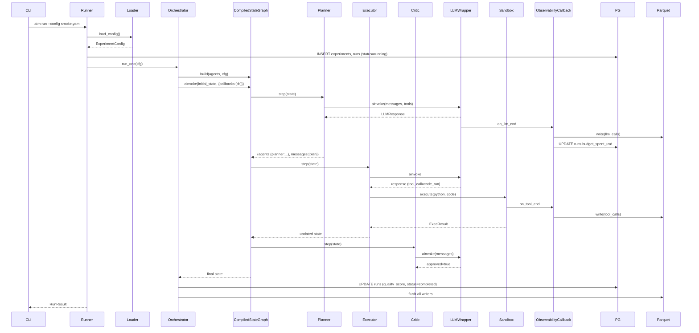
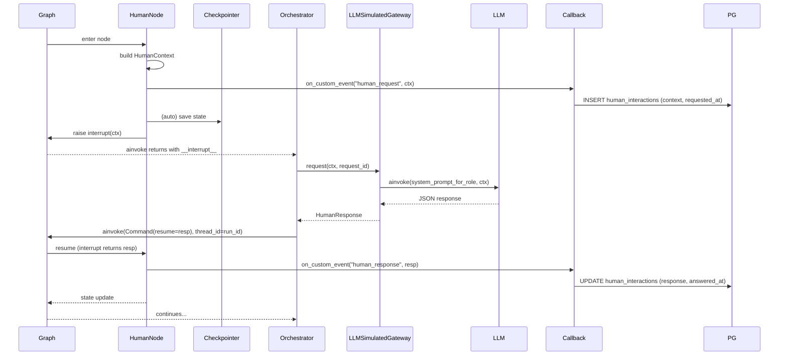

# Adaptive Topologies MAS — Architecture (arch.md)

> Архитектурный документ технической части диплома. Описывает слои, контракты, инварианты, data-flow и точки расширения для фреймворка адаптивных топологий мульти-агентных LLM-систем с HITL. Документ предполагает знание `PLAN.md` (milestone-план, стек, репо-структура) — здесь фиксируется следующий уровень детализации.

---

## Оглавление

1. [Context & scope](#1-context--scope)
2. [Layered architecture](#2-layered-architecture)
3. [Core data model](#3-core-data-model)
4. [LLM layer](#4-llm-layer)
5. [Tools layer](#5-tools-layer)
6. [Agent layer](#6-agent-layer)
7. [Topology layer](#7-topology-layer)
8. [Phase Manager](#8-phase-manager)
9. [Human Gateway](#9-human-gateway)
10. [Observability](#10-observability)
11. [Storage](#11-storage)
12. [Experiment layer](#12-experiment-layer)
13. [Evaluation](#13-evaluation)
14. [Cross-cutting concerns](#14-cross-cutting-concerns)
15. [Extensibility](#15-extensibility)
16. [Диаграммы](#16-диаграммы)
17. [Architectural decisions refining PLAN.md](#17-architectural-decisions-refining-planmd)
18. [Open architectural questions](#18-open-architectural-questions)

---

## 1. Context & scope

### 1.1 Что входит в этап 1 (до M13 включительно)

- Ядро: `core/types`, LangGraph-совместимый `GraphState` + reducer, `LLMWrapper` с three-tier budget, `DockerSandbox`, `Agent` с scratchpad-политикой C.
- 5 статических топологий (Star/Chain/Mesh/Debate/Hierarchical) + Adaptive meta-graph с Phase Manager.
- HITL: `HumanGateway` Protocol + две реализации — `LLMSimulatedGateway` (primary для этапа 1) и `CLIGateway` (для отладки); 5 ролей (Coordinator / Reviewer / Judge / Peer / Monitor).
- Observability: `ExperimentCallbackHandler` как единственный writer в Parquet + Postgres во время run-а.
- Experiment runner: Pydantic v2 + OmegaConf, ProcessPoolExecutor для grid, dry-run estimator, Typer CLI.
- Evaluation: ground-truth runners (HumanEval, MMLU), LLM-judge (pairwise + self-consistency), NASA-TLX агрегация.
- Analysis: pandas-лоадеры + шаблонные графики.

### 1.2 Что вынесено в этап 2 (M14+)

- Streamlit UI для живых пользователей.
- Сбор NASA-TLX через UI.
- Замена `LLMSimulatedGateway` на живого участника (`StreamlitGateway`).
- Протокол proctoring для user-studies.

Этап 1 должен оставить интерфейсы (`HumanGateway`, `HumanContext`, `HumanResponse`), при которых этап 2 не требует правок в `topology/`, `agents/`, `phases/`.

### 1.3 Нефункциональные требования

| NFR | Требование |
|---|---|
| Воспроизводимость | Один и тот же `seed` + конфиг + модельная версия даёт идентичный data trail (логи, checkpoints, метрики) при `FakeLLM`. Для реальных LLM — воспроизводимы шаги графа и инструменты; LLM-ответы фиксируются в `llm_calls.parquet` и могут быть replay-ены через `FakeLLM(replay_from=...)`. |
| Бюджет | Three-tier guard (call/run/experiment) с hard-stop и soft-warn. Dry-run estimator обязательно вызывается перед любым grid-run-ом. |
| Детерминизм | `seed` пробрасывается в Python `random`, NumPy, Pandas sampling, LLM-judge (temperature=0). Tool-order и agent-activation-order — детерминированы при фиксированном seed. |
| Изоляция | Код, сгенерированный LLM-ом, исполняется только в `DockerSandbox` (network=none, read-only rootfs, cap-drop ALL, no-new-privileges). `subprocess_sandbox` — dev-only, с явным env-флагом. |
| Independence of layers | Нижние слои не знают про верхние. `Agent` не знает, в какой топологии он живёт. `Topology` не знает про конкретного LLM-провайдера. `Tool` не знает про `Agent`. |

### 1.4 Предположения

- Python 3.11+, uv, Postgres 16, Docker ≥ 24 с rootless-поддержкой (опц.).
- LangGraph ≥ 0.3, `langgraph-checkpoint-postgres` ≥ 2.0 (AsyncPostgresSaver + pool), `langchain-core` с Pydantic v2 путём.
- Pydantic v2 как primary; совместимость через `langchain_core.utils.pydantic` где LangChain того требует.

---

## 2. Layered architecture

Слои строго однонаправлены: верхний знает про нижние, нижний не знает про верхние. Observability — ортогональный слой, потребляющий события через LangChain callback API.

```
┌──────────────────────────────────────────────────────┐
│ Experiment      │  CLI, grid, sweep, dry-run         │
├──────────────────────────────────────────────────────┤
│ Orchestrator    │  один run: wire agents→topology    │
│                 │  →CompiledStateGraph →invoke       │
├──────────────────────────────────────────────────────┤
│ Phase Manager   │  FSM; router; записывает           │
│                 │  PhaseTransition                   │
├──────────────────────────────────────────────────────┤
│ Topology        │  5 статических + Adaptive meta     │
│                 │  build(agents,cfg)→CompiledGraph   │
├──────────────────────────────────────────────────────┤
│ Human Gateway   │  единая абстракция HITL            │
├──────────────────────────────────────────────────────┤
│ Agent           │  role + prompt + tools + llm       │
│                 │  step(state)→state                 │
├──────────────────────────────────────────────────────┤
│ Tools           │  Tool Protocol, registry, sandbox  │
├──────────────────────────────────────────────────────┤
│ LLM             │  LLMWrapper + Budget + Pricing     │
├──────────────────────────────────────────────────────┤
│ Storage         │  SQLAlchemy + Parquet +            │
│                 │  Postgres checkpointer             │
├──────────────────────────────────────────────────────┤
│ Core            │  Message, ToolCall, GraphState,    │
│                 │  reducer, errors                   │
└──────────────────────────────────────────────────────┘
          ↑ Observability (callback) читает из всех ↑
```

### 2.1 Ответственности и границы

| Слой | Отвечает | Не отвечает |
|---|---|---|
| Core | Типы, state schema, reducer, исключения | Persistence, IO, LLM |
| LLM | Унификация chat-models, usage/cost, budget, retry, prompt-cache | Бизнес-логика агента, tool-исполнение |
| Tools | JSON-схемы, async invoke, sandbox | Решение, какой tool вызвать (это LLM) |
| Agent | Prompt-building, tool-loop, scratchpad, один шаг графа | Межагентная оркестрация, persistence |
| Human Gateway | Единый async-контракт запрос→ответ, interrupt/resume | Персистентность ответов (делает callback/runner) |
| Topology | Сборка `CompiledStateGraph` из агентов, edges, условия | Выбор модели, конфиг-загрузка |
| Phase Manager | FSM фаз, routing решения, запись `phases` | Сама логика агентов |
| Orchestrator (runner) | Один run end-to-end: load→build→invoke→finalize | Grid-политика, sweep |
| Observability | Все writes в Parquet/PG во время run-а | Ничего не мутирует в state |
| Storage | Async SQLAlchemy, Parquet writer, PG checkpointer | Агрегация метрик, визуализация |
| Experiment | Grid, sweep, dry-run, CLI | Сама логика графа |
| Evaluation | `TaskResult → metrics`, judges, ground-truth | Запись run-данных (это observability) |

### 2.2 Правила зависимостей

- `core/` — ни на кого не зависит внутри `atm/`.
- `llm/`, `tools/` — зависят только от `core/`.
- `agents/` — от `core/`, `llm/`, `tools/`.
- `topology/`, `phases/`, `human/` — от `core/`, `agents/` (агенты как узлы графа).
- `observability/` — от `core/`, `storage/`. **Никто** не зависит от observability: callbacks подключаются через LangChain `config={"callbacks": [...]}`.
- `storage/` — от `core/` (для сериализации моделей).
- `experiment/` — верхний слой, зависит от всех остальных.
- `evaluation/` — зависит от `core/`, `llm/` (для judge), `tasks/`.

Запрещённые зависимости (enforced ruff/import-linter):
- `agents/` → `topology/`, `experiment/`
- `tools/` → `agents/`, `llm/`
- `core/` → что-либо кроме stdlib/pydantic/typing

---

## 3. Core data model

### 3.1 Pydantic-модели (`src/atm/core/types.py`)

Используется Pydantic v2. Все модели `frozen=True` где возможно (сообщения/ивенты — immutable); state-контейнеры — мутабельны.

```python
from __future__ import annotations
from datetime import datetime
from enum import Enum
from typing import Any, Literal, Optional
from uuid import UUID, uuid4
from pydantic import BaseModel, ConfigDict, Field


class AgentRole(str, Enum):
    PLANNER = "planner"
    RESEARCHER = "researcher"
    EXECUTOR = "executor"
    CRITIC = "critic"
    DEBATER = "debater"
    COORDINATOR = "coordinator"  # для Hierarchical


class HumanRole(str, Enum):
    COORDINATOR = "coordinator"
    REVIEWER = "reviewer"
    JUDGE = "judge"
    PEER = "peer"
    MONITOR = "monitor"


class Phase(str, Enum):
    PLANNING = "planning"
    EXECUTION = "execution"
    VERIFICATION = "verification"
    DONE = "done"


class MessageKind(str, Enum):
    REQUEST = "request"       # адресное: agent → agent
    BROADCAST = "broadcast"   # в shared bus (Mesh)
    DRAFT = "draft"
    CRITIQUE = "critique"
    DECISION = "decision"     # Coordinator → конечный ответ
    PHASE_EMIT = "phase_emit" # агент просит сменить фазу


class Message(BaseModel):
    """Межагентское сообщение. Immutable. Доменная модель, параллельна LangChain BaseMessage.

    Граница с LangChain — строго на `LLMWrapper.ainvoke`/`from_lc`:
    топология и агенты работают только с `Message`; адаптер вызывается
    на точке вызова LLM.
    """
    model_config = ConfigDict(frozen=True)

    id: UUID = Field(default_factory=uuid4)
    sender: str                              # agent_id
    recipients: tuple[str, ...] = ()         # пусто = broadcast
    kind: MessageKind
    content: str
    payload: dict[str, Any] = Field(default_factory=dict)
    refs: tuple[UUID, ...] = ()              # reply-to chain
    created_at: datetime = Field(default_factory=datetime.utcnow)

    def to_lc(self) -> "BaseMessage":
        """Адаптер в LangChain BaseMessage для передачи в LLM.
        Маппинг kind → LC-type:
          request/draft/critique → HumanMessage (роль = sender)
          decision               → AIMessage
          broadcast              → HumanMessage с metadata={'channel':'broadcast'}
          phase_emit             → SystemMessage (мета-событие)
        """
        ...

    @classmethod
    def from_lc(cls, lc_msg: "BaseMessage", *, sender: str, kind: MessageKind) -> "Message":
        """Обратный адаптер. Контракт: LC-специфичные поля (tool_calls, additional_kwargs)
        едут в `payload` под ключом '_lc'. Ответственность вызывающего — выдергивать
        их оттуда, если нужны (не доступны как первоклассные атрибуты Message).
        """
        ...


class ToolCall(BaseModel):
    model_config = ConfigDict(frozen=True)

    id: UUID = Field(default_factory=uuid4)
    tool_name: str
    args: dict[str, Any]
    issued_by: str                           # agent_id
    issued_at: datetime = Field(default_factory=datetime.utcnow)


class ToolResult(BaseModel):
    model_config = ConfigDict(frozen=True)

    call_id: UUID
    ok: bool
    output: Any
    error: Optional[str] = None
    latency_ms: int
    finished_at: datetime = Field(default_factory=datetime.utcnow)


class TokenUsage(BaseModel):
    model_config = ConfigDict(frozen=True)

    prompt_tokens: int
    completion_tokens: int
    cached_input_tokens: int = 0
    total_tokens: int                        # invariant: prompt+completion (cached — подмножество prompt)


class LLMResponse(BaseModel):
    """Итог одного ainvoke. Содержит и текст, и tool-calls если модель попросила."""
    model_config = ConfigDict(frozen=True)

    id: UUID = Field(default_factory=uuid4)
    model: str
    text: Optional[str]
    tool_calls: tuple[ToolCall, ...] = ()
    usage: TokenUsage
    cost_usd: float
    latency_ms: int
    finish_reason: Literal["stop", "tool_calls", "length", "content_filter", "error"]
    raw: dict[str, Any] = Field(default_factory=dict)  # для дебага; в Parquet не пишем полностью


class HumanContext(BaseModel):
    """Что топология передаёт человеку/gateway для принятия решения."""
    model_config = ConfigDict(frozen=True)

    run_id: UUID
    role: HumanRole
    question: str
    recent_messages: tuple[Message, ...]
    artifacts: dict[str, Any] = Field(default_factory=dict)  # draft, tests, diffs, etc.
    allowed_actions: tuple[str, ...]                         # напр. ("approve","reject","revise")
    deadline_s: Optional[int] = None


class HumanResponse(BaseModel):
    model_config = ConfigDict(frozen=True)

    action: str                              # один из allowed_actions ИЛИ служебный 'timeout'/'cancelled'
    comment: Optional[str] = None
    payload: dict[str, Any] = Field(default_factory=dict)    # структурированные правки
    answered_at: datetime = Field(default_factory=datetime.utcnow)
    tlx_scores: Optional[dict[str, int]] = None              # 6 шкал NASA-TLX, 0..100
    timed_out: bool = False                                  # True если gateway вернул timeout-response
    source: Literal["human", "llm_sim", "fallback", "timeout"] = "human"


class TaskSpec(BaseModel):
    """Описание одной задачи из бенчмарка."""
    model_config = ConfigDict(frozen=True)

    id: str                                  # "humaneval/HumanEval/0"
    type: Literal["programming", "qa", "creative", "analysis"]
    input: str
    expected: Optional[str] = None
    metadata: dict[str, Any] = Field(default_factory=dict)
    evaluator_key: str                       # ключ в EvaluatorRegistry


class TaskResult(BaseModel):
    """Результат одного run-а относительно одной TaskSpec. Immutable post-run."""
    model_config = ConfigDict(frozen=True)

    task_id: str
    final_answer: str
    artifacts: dict[str, Any] = Field(default_factory=dict)  # code, tests, diffs
    iterations_used: int
    budget_spent_usd: float
    wall_time_s: float


class RunResult(BaseModel):
    model_config = ConfigDict(frozen=True)

    run_id: UUID
    status: Literal["completed", "failed", "budget_exceeded", "cancelled"]
    task_result: Optional[TaskResult]
    error: Optional[str] = None
    metrics: dict[str, float] = Field(default_factory=dict)  # заполняется Evaluator


class PhaseTransition(BaseModel):
    """Фазы монотонны (planning → execution → verification → done).
    Запись создаётся только при advance фазы; intra-phase события топологии
    фиксируются в TopologyTransition."""
    model_config = ConfigDict(frozen=True)

    id: UUID = Field(default_factory=uuid4)
    run_id: UUID
    from_phase: Optional[Phase]              # None только на стартовом init
    to_phase: Phase
    entry_reason: str
    iter_total: int                          # абсолютный счётчик тиков meta-графа
    decided_by: Literal["rule", "llm_router", "agent_emit", "initial"]
    at: datetime = Field(default_factory=datetime.utcnow)


class TopologyTransition(BaseModel):
    """Решение TopologyRouter-а (фиксируется И при фактическом switch'е,
    И при 'no change' — для полноты RQ2-анализа).
    Источник истины для всех метрик runtime-адаптации топологии.
    """
    model_config = ConfigDict(frozen=True)

    id: UUID = Field(default_factory=uuid4)
    run_id: UUID
    from_topology: Optional[str]             # None только на стартовом решении
    to_topology: str                         # == from_topology если no-change
    phase_at_decision: Phase
    iter_within_phase: int
    iter_within_topology: int                # 0 если это switch (новая топология)
    decided_by: Literal["rule", "llm_router", "oracle", "guard_override", "initial"]
    reason: str
    considered_alternatives: tuple[str, ...] = ()
    guards_applied: tuple[str, ...] = ()     # имена guard-ов, которые сработали
    signals_snapshot: dict[str, Any] = Field(default_factory=dict)
    router_cost_usd: float = 0.0             # >0 только для llm_router
    at: datetime = Field(default_factory=datetime.utcnow)


class BudgetEvent(BaseModel):
    model_config = ConfigDict(frozen=True)

    run_id: UUID
    level: Literal["call", "run", "experiment"]
    event: Literal["warn", "exceed"]
    limit_usd: float
    current_usd: float
    at: datetime = Field(default_factory=datetime.utcnow)
```

### 3.2 LangGraph state (`src/atm/core/state.py`)

Используется **TypedDict** (не `BaseModel`). Официальные LangGraph docs 2026 называют TypedDict primary, Pydantic BaseModel — "supported with caveats": валидация перед каждым вызовом ноды = заметный overhead на гриде; `langchain.create_agent` не поддерживает Pydantic state; есть открытые баги с generic-типами ([langgraph#4060](https://github.com/langchain-ai/langgraph/issues/4060), [#1977](https://github.com/langchain-ai/langgraph/issues/1977)). Все **данные внутри state** — Pydantic v2 (`Message`, `LLMResponse`, `ToolCall` и т.п.): валидация на границах. Полное обоснование и code-правило — §17.

```python
from __future__ import annotations
from typing import Annotated, TypedDict
import operator
from uuid import UUID
from atm.core.types import (
    Message, ToolCall, ToolResult, LLMResponse, Phase, HumanRole, HumanResponse,
)


class AgentState(TypedDict, total=False):
    """Per-agent подсостояние. Попадает в GraphState под ключом agent_id."""
    agent_id: str
    role: str                                 # AgentRole.value
    inbox: list[Message]                      # адресованные этому агенту
    outbox: list[Message]                     # для маршрутизации роутером топологии
    scratchpad: list[dict]                    # append-only журнал {step, reasoning, tool_call?, observation?}
    tool_calls: list[ToolCall]
    tool_results: list[ToolResult]
    summary_before_window: str                # summarizer output (scratchpad policy C)
    step_count: int
    tokens_spent: int
    cost_spent_usd: float


class SharedState(TypedDict, total=False):
    """Глобальное пространство графа: всё, что видят все агенты."""
    task_id: str
    task_input: str
    final_answer: str | None

    # --- Phase axis (монотонна: planning → execution → verification → done) ---
    phase: Phase
    phase_started_at_iter: int                # абс. tick meta-графа, на котором вошли в фазу
    phase_history: list[Phase]

    # --- Topology axis (может меняться runtime внутри фазы; см. §7.7, §8bis) ---
    active_topology: str | None
    topology_started_at_iter: int             # абс. tick, на котором активирована текущая топология
    topology_switch_count: int                # счётчик фактических switch'ей (для max_switches guard)
    topology_history: list[str]               # короткий хвост (последние K) для cooldown-check

    # --- Adaptive iteration counters ---
    iteration: int                            # legacy/общий (итераций внутри текущего subgraph)
    iter_total: int                           # абсолютный tick meta-графа (не сбрасывается)

    # --- Communication/Mesh ---
    broadcast_bus: list[Message]              # для Mesh; очищается при любом transition

    # --- HITL ---
    human_requests: list[dict]                # pending HITL запросы (для debug)
    human_responses: list[HumanResponse]

    # --- Canal агент → router (L2 quasi-preemption) ---
    # Агенты эмитят сигналы (stuck, rejected_count, needs_debate, ready_for_*).
    # TransitionGate передаёт TopologyRouter'у, потом очищает consumed ключи.
    signals: dict[str, Any]


class GraphState(TypedDict, total=False):
    """Полный state графа. Ключи верхнего уровня:
       - 'shared' — SharedState
       - 'agents' — dict[agent_id, AgentState]
       - 'messages' — плоская история (dedup-by-id при fan-in из subgraph'ов)
       - 'llm_calls' — история LLMResponse (для observability и replay)
       - 'budget_events' — внутри-run budget-сигналы
       - 'topology_transitions' — решения TopologyRouter-а (L2); источник для RQ2-анализа
    """
    shared: SharedState
    agents: Annotated[dict[str, AgentState], merge_agent_states]
    # dedup-by-id reducer'ы (см. §3.3): subgraph'ы Adaptive возвращают полные списки,
    # operator.add давал бы экспоненциальные дубли при каждом fan-in.
    messages: Annotated[list[Message], dedup_by_id_reducer("id", sort_by="created_at")]
    llm_calls: Annotated[list[LLMResponse], dedup_by_id_reducer("id")]
    budget_events: Annotated[list[BudgetEvent], dedup_by_id_reducer("id", sort_by="at")]
    topology_transitions: Annotated[
        list[TopologyTransition], dedup_by_id_reducer("id", sort_by="at")
    ]
```

### 3.3 Reducer `merge_agent_states`

**Сигнатура и инварианты.**

```python
from typing import Callable

AgentReducer = Callable[[dict[str, AgentState], dict[str, AgentState]], dict[str, AgentState]]


def merge_agent_states(
    left: dict[str, AgentState] | None,
    right: dict[str, AgentState] | None,
) -> dict[str, AgentState]:
    """Сливает два словаря agent_id → AgentState.

    Правила per-key:
      inbox, outbox, scratchpad, tool_calls, tool_results: append (list concat)
      summary_before_window: right wins if non-empty else left
      step_count, tokens_spent, cost_spent_usd: max(left, right)
          (каждый апдейт приходит от самого агента с монотонно растущими значениями;
           max защищает от гонки, если fan-out/fan-in вернул промежуточное значение)
      agent_id, role: left wins (immutable после инициализации)

    Инварианты:
      1. Идемпотентность per-agent: merge(x, x) == x
      2. Коммутативность для полей inbox/outbox/scratchpad/tool_calls —
         ЛОЖНА: порядок сообщений важен. Для них right всегда новее (по контракту
         LangGraph reducer left=старый state, right=update от node).
      3. Ассоциативность: (a⊕b)⊕c == a⊕(b⊕c) — ДА для числовых max и list-concat,
         при условии что внутри одного super-step фаны не пересекаются по agent_id
         (LangGraph это гарантирует: одну ноду не запускают параллельно дважды).
      4. Пустой нейтральный элемент: merge({}, x) == x; merge(x, {}) == x.

    Предусловия:
      - Оба аргумента либо None, либо dict[str, AgentState].
      - AgentState всегда включает поле agent_id, совпадающее с ключом словаря.

    Постусловия:
      - Набор ключей результата = union(left.keys, right.keys).
      - Для каждого ключа-пересечения tools/messages/scratchpad монотонно не убывают в длине.
    """
    if not left:
        return dict(right or {})
    if not right:
        return dict(left)

    out: dict[str, AgentState] = {}
    for aid in set(left) | set(right):
        l = left.get(aid, {})
        r = right.get(aid, {})
        out[aid] = _merge_one(l, r)
    return out


def _merge_one(l: AgentState, r: AgentState) -> AgentState:
    merged: AgentState = {}
    for key in ("agent_id", "role"):
        merged[key] = l.get(key) or r.get(key)
    for key in ("inbox", "outbox", "scratchpad", "tool_calls", "tool_results"):
        merged[key] = list(l.get(key, [])) + list(r.get(key, []))
    merged["summary_before_window"] = r.get("summary_before_window") or l.get("summary_before_window", "")
    for key in ("step_count", "tokens_spent"):
        merged[key] = max(l.get(key, 0), r.get(key, 0))
    merged["cost_spent_usd"] = max(l.get("cost_spent_usd", 0.0), r.get("cost_spent_usd", 0.0))
    return merged
```

Регистрация reducer-а: LangGraph `Annotated[dict, reducer_callable]` (оператор — `merge_agent_states` как callable).

### 3.3bis `dedup_by_id_reducer` — общий reducer для append-списков с уникальными id

**Мотивация.** Adaptive meta-граф (§7.7) инвоцирует subgraph'ы один за другим. Каждый subgraph при exit'е возвращает **полный** список `messages` / `llm_calls` / `budget_events` / `topology_transitions` (включая унаследованные из parent). Простой `operator.add` при fan-in в parent-state даёт `parent + subgraph_full` → кратный дубль. На тике N дубли мультиплицируются → экспоненциальный рост. Это закрывает open question #1 из §18 (выбранное решение: **(A) dedup-by-id**; варианты (B) per-subgraph namespace и (C) callback-only были отвергнуты — оба ломают доступ агентов новой топологии к истории старой, что критично для L2).

```python
from typing import Any, Callable, Hashable, Protocol, Sequence


def dedup_by_id_reducer(
    key: str = "id",
    *,
    sort_by: str | None = None,
) -> Callable[[list[Any] | None, list[Any] | None], list[Any]]:
    """Возвращает reducer, делающий union двух списков по уникальному id-полю.

    Контракт:
      - элементы list-а — Pydantic BaseModel (frozen) или dict с полем `key`.
      - при пересечении id побеждает элемент из `left` (исторически более ранний fan-in);
        это гарантирует idempotency: reducer(x, x) == x.
      - если sort_by указан — результат сортируется по этому полю ASC.
      - None-аргументы трактуются как пустые списки.

    Инварианты:
      1. Идемпотентность: reducer(x, x) == x.
      2. Коммутативность по множеству id: set(ids(reducer(a, b))) == set(ids(a) ∪ ids(b)).
         По порядку — нет (right дописывается после left).
      3. Ассоциативность: ((a⊕b)⊕c) == (a⊕(b⊕c)) — ДА, т.к. union ассоциативен;
         порядок финального списка определяется sort_by (детерминирован) или первым
         вхождением каждого id в обходе left→right.
      4. Нейтральный элемент: reducer([], x) == x; reducer(x, []) == x.

    Complexity: O(n + m) по множеству; O((n+m) log (n+m)) при sort_by.
    """
    def _get(item: Any, k: str) -> Hashable:
        return item[k] if isinstance(item, dict) else getattr(item, k)

    def _reduce(left: list[Any] | None, right: list[Any] | None) -> list[Any]:
        if not left:
            return list(right or [])
        if not right:
            return list(left)
        seen: set[Hashable] = {_get(x, key) for x in left}
        merged = list(left) + [x for x in right if _get(x, key) not in seen]
        if sort_by is not None:
            merged.sort(key=lambda x: _get(x, sort_by))
        return merged

    return _reduce
```

**Где применяется** (см. `GraphState` в §3.2):

| Ключ | `key` | `sort_by` | Причина |
|---|---|---|---|
| `messages` | `id` (UUID) | `created_at` | плоская timeline межагентской переписки, важен порядок для аналитики |
| `llm_calls` | `id` (UUID) | `started_at` (в LLMResponse добавить поле при необходимости) | последовательность вызовов для replay |
| `budget_events` | `id` (UUID) | `at` | последовательность warn/exceed |
| `topology_transitions` | `id` (UUID) | `at` | RQ2-аналитика (E3/E4) |

Для всех четырёх — UUID генерируется при конструировании модели, поэтому дубль при fan-in всегда имеет тот же id и корректно сворачивается.

**Почему не глобально для `agents`.** `agents` — словарь `dict[agent_id, AgentState]`, не список; и его инкрементальный merge не сводится к dedup (надо append'ить inbox/outbox/scratchpad и max'ить счётчики, см. `merge_agent_states`). Два reducer'а сосуществуют.

### 3.4 SQLAlchemy-модели (`src/atm/storage/models.py`)

Async SQLAlchemy 2.x, Mapped-style. Ключевые таблицы:

| Таблица | Колонка | Тип | Null | FK / индексы |
|---|---|---|---|---|
| `experiments` | id | `UUID PK` | no | |
|  | name | `TEXT` | no | unique |
|  | config_snapshot | `JSONB` | no | |
|  | git_sha | `VARCHAR(40)` | no | |
|  | started_at | `TIMESTAMPTZ` | no | idx |
|  | finished_at | `TIMESTAMPTZ` | yes | |
|  | total_cost_usd | `NUMERIC(10,4)` | no default 0 | |
|  | status | `VARCHAR(16)` | no | enum(`pending`,`running`,`done`,`failed`) |
| `runs` | id | `UUID PK` | no | |
|  | exp_id | `UUID FK experiments.id` | no | idx |
|  | topology | `VARCHAR(32)` | no | idx |
|  | task_id | `VARCHAR(128)` | no | idx |
|  | agent_set | `VARCHAR(64)` | no | |
|  | human_role | `VARCHAR(32)` | yes | |
|  | seed | `INTEGER` | no | |
|  | model | `VARCHAR(64)` | no | primary model_id из конфига (для обратной совместимости; детали — models_by_role_json) |
|  | models_by_role_json | `JSONB` | no default '{}' | снимок `ModelCfg.by_role` — per-role модели на момент run-а |
|  | model_version_snapshot | `JSONB` | no default '{}' | `{model_id: version}` (напр. `{"openai:gpt-4o":"2024-11-20"}`) — для exact replay |
|  | sandbox_image_digest | `VARCHAR(80)` | yes | sha256:… докер-образа sandbox; null для dev subprocess_sandbox |
|  | status | `VARCHAR(16)` | no | idx |
|  | finish_reason | `VARCHAR(32)` | yes | enum(`success`,`max_iter`,`topology_max`,`budget_exceeded`,`error`,`human_timeout`) |
|  | budget_spent_usd | `NUMERIC(10,4)` | no | |
|  | quality_score | `DOUBLE PRECISION` | yes | |
|  | wall_time_s | `DOUBLE PRECISION` | yes | |
|  | iterations | `INTEGER` | yes | |
|  | started_at, finished_at | `TIMESTAMPTZ` | | idx started_at |
|  | error | `TEXT` | yes | |
| `phases` | id | `UUID PK` | no | |
|  | run_id | `UUID FK runs.id` | no | idx |
|  | phase_name | `VARCHAR(32)` | no | |
|  | from_phase | `VARCHAR(32)` | yes | |
|  | started_at | `TIMESTAMPTZ` | no | |
|  | ended_at | `TIMESTAMPTZ` | yes | |
|  | entry_reason | `TEXT` | no | |
|  | topology_used | `VARCHAR(32)` | no | |
|  | decided_by | `VARCHAR(16)` | no | |
| `human_interactions` | id | `UUID PK` | no | |
|  | run_id | `UUID FK runs.id` | no | idx |
|  | role | `VARCHAR(32)` | no | |
|  | requested_at | `TIMESTAMPTZ` | no | |
|  | answered_at | `TIMESTAMPTZ` | yes | |
|  | context_json | `JSONB` | no | HumanContext.model_dump() |
|  | response_json | `JSONB` | yes | HumanResponse.model_dump() |
|  | tlx_scores | `JSONB` | yes | |
| `budget_events` | id | `UUID PK` | no | |
|  | run_id | `UUID FK runs.id` | no | idx |
|  | level | `VARCHAR(16)` | no | |
|  | event | `VARCHAR(16)` | no | |
|  | limit_usd | `NUMERIC(10,4)` | no | |
|  | current_usd | `NUMERIC(10,4)` | no | |
|  | at | `TIMESTAMPTZ` | no | |
| `topology_transitions` | id | `UUID PK` | no | |
|  | run_id | `UUID FK runs.id` | no | idx |
|  | from_topology | `VARCHAR(32)` | yes | (null только для initial) |
|  | to_topology | `VARCHAR(32)` | no | == from_topology если no-change |
|  | phase_at_decision | `VARCHAR(32)` | no | |
|  | iter_within_phase | `INTEGER` | no | |
|  | iter_within_topology | `INTEGER` | no | |
|  | decided_by | `VARCHAR(24)` | no | idx — enum(`rule`,`llm_router`,`oracle`,`guard_override`,`initial`) |
|  | reason | `TEXT` | no | |
|  | considered_alternatives | `TEXT[]` | no default '{}' | |
|  | guards_applied | `TEXT[]` | no default '{}' | |
|  | signals_snapshot | `JSONB` | no default '{}' | |
|  | router_cost_usd | `NUMERIC(10,4)` | no default 0 | |
|  | at | `TIMESTAMPTZ` | no | idx |
| `checkpoints*` | — | — | — | управляются `langgraph-checkpoint-postgres` через `.setup()` |

DDL для `topology_transitions` (для понимания; источник истины для RQ2):

```sql
CREATE TABLE topology_transitions (
    id                       UUID PRIMARY KEY,
    run_id                   UUID NOT NULL REFERENCES runs(id) ON DELETE CASCADE,
    from_topology            VARCHAR(32),
    to_topology              VARCHAR(32) NOT NULL,
    phase_at_decision        VARCHAR(32) NOT NULL,
    iter_within_phase        INTEGER NOT NULL,
    iter_within_topology     INTEGER NOT NULL,
    decided_by               VARCHAR(24) NOT NULL,
    reason                   TEXT NOT NULL,
    considered_alternatives  TEXT[] NOT NULL DEFAULT '{}',
    guards_applied           TEXT[] NOT NULL DEFAULT '{}',
    signals_snapshot         JSONB NOT NULL DEFAULT '{}',
    router_cost_usd          NUMERIC(10,4) NOT NULL DEFAULT 0,
    at                       TIMESTAMPTZ NOT NULL DEFAULT now()
);
CREATE INDEX topology_transitions_run_id_idx     ON topology_transitions(run_id);
CREATE INDEX topology_transitions_decided_by_idx ON topology_transitions(decided_by);
CREATE INDEX topology_transitions_at_idx         ON topology_transitions(at);
```

**Важно:** каждая итерация `TopologyRouter.decide()` производит ровно одну строку — и при реальном switch'е (`from != to`), и при «no change» (`from == to`), и при `guard_override` (router хотел X, guard оставил Y). Это источник истины для всех RQ2-метрик: `topology_switch_count`, `guard_override_rate`, `router_cost_share`, `oracle_gap`.

DDL-эквивалент для `runs` (для понимания):

```sql
CREATE TABLE runs (
    id                     UUID PRIMARY KEY,
    exp_id                 UUID NOT NULL REFERENCES experiments(id) ON DELETE CASCADE,
    topology               VARCHAR(32) NOT NULL,
    task_id                VARCHAR(128) NOT NULL,
    agent_set              VARCHAR(64) NOT NULL,
    human_role             VARCHAR(32),
    seed                   INTEGER NOT NULL,
    model                  VARCHAR(64) NOT NULL,
    models_by_role_json    JSONB NOT NULL DEFAULT '{}',
    model_version_snapshot JSONB NOT NULL DEFAULT '{}',
    sandbox_image_digest   VARCHAR(80),
    status                 VARCHAR(16) NOT NULL,
    finish_reason          VARCHAR(32),
    budget_spent_usd       NUMERIC(10,4) NOT NULL DEFAULT 0,
    quality_score          DOUBLE PRECISION,
    wall_time_s            DOUBLE PRECISION,
    iterations             INTEGER,
    started_at             TIMESTAMPTZ NOT NULL DEFAULT now(),
    finished_at            TIMESTAMPTZ,
    error                  TEXT
);
CREATE INDEX runs_exp_id_idx    ON runs(exp_id);
CREATE INDEX runs_topology_idx  ON runs(topology);
CREATE INDEX runs_task_id_idx   ON runs(task_id);
CREATE INDEX runs_status_idx    ON runs(status);
CREATE INDEX runs_started_idx   ON runs(started_at DESC);
```

### 3.5 Parquet-схемы (pyarrow)

Директория: `data/experiments/{exp_id}/runs/{run_id}/`.

```python
import pyarrow as pa

LLM_CALLS_SCHEMA = pa.schema([
    ("run_id",           pa.string()),
    ("call_id",          pa.string()),
    ("agent_id",         pa.string()),
    ("role",             pa.string()),
    ("model",            pa.string()),
    ("prompt_tokens",    pa.int32()),
    ("completion_tokens",pa.int32()),
    ("cached_input_tokens", pa.int32()),
    ("total_tokens",     pa.int32()),
    ("cost_usd",         pa.float64()),
    ("latency_ms",       pa.int32()),
    ("finish_reason",    pa.string()),
    ("phase",            pa.string()),
    ("iteration",        pa.int32()),
    ("started_at",       pa.timestamp("us")),
])

MESSAGES_SCHEMA = pa.schema([
    ("run_id",      pa.string()),
    ("message_id",  pa.string()),
    ("sender",      pa.string()),
    ("recipients",  pa.list_(pa.string())),
    ("kind",        pa.string()),
    ("content",     pa.string()),
    ("refs",        pa.list_(pa.string())),
    ("payload_json",pa.string()),  # JSON-сериализован; избегаем widely-variable dict-schema
    ("phase",       pa.string()),
    ("iteration",   pa.int32()),
    ("created_at",  pa.timestamp("us")),
])

TOOL_CALLS_SCHEMA = pa.schema([
    ("run_id",     pa.string()),
    ("call_id",    pa.string()),
    ("tool_name",  pa.string()),
    ("issued_by",  pa.string()),
    ("args_json",  pa.string()),
    ("ok",         pa.bool_()),
    ("output_repr",pa.string()),
    ("error",      pa.string()),  # nullable
    ("latency_ms", pa.int32()),
    ("issued_at",  pa.timestamp("us")),
])

SCRATCHPAD_SCHEMA = pa.schema([
    ("run_id",     pa.string()),
    ("agent_id",   pa.string()),
    ("step",       pa.int32()),
    ("kind",       pa.string()),  # "reasoning"|"tool_call"|"observation"|"summary"
    ("content",    pa.string()),
    ("at",         pa.timestamp("us")),
])

PHASES_SCHEMA = pa.schema([
    ("run_id",         pa.string()),
    ("from_phase",     pa.string()),
    ("to_phase",       pa.string()),
    ("entry_reason",   pa.string()),
    ("iter_total",     pa.int32()),
    ("decided_by",     pa.string()),
    ("at",             pa.timestamp("us")),
])

TOPOLOGY_TRANSITIONS_SCHEMA = pa.schema([
    ("run_id",                 pa.string()),
    ("transition_id",          pa.string()),
    ("from_topology",          pa.string()),  # nullable
    ("to_topology",            pa.string()),
    ("phase_at_decision",      pa.string()),
    ("iter_within_phase",      pa.int32()),
    ("iter_within_topology",   pa.int32()),
    ("decided_by",             pa.string()),
    ("reason",                 pa.string()),
    ("considered_alternatives",pa.list_(pa.string())),
    ("guards_applied",         pa.list_(pa.string())),
    ("signals_snapshot_json",  pa.string()),  # JSON-сериализован для schema-стабильности
    ("router_cost_usd",        pa.float64()),
    ("at",                     pa.timestamp("us")),
])
```

**Принцип дублирования PG ↔ Parquet:**

| Данные | PG | Parquet | Где primary |
|---|---|---|---|
| Experiment/run метаданные | ✓ | json-дубль | PG |
| Phase transitions | ✓ | ✓ | PG |
| Topology transitions | ✓ | ✓ | PG |
| Human interactions | ✓ | — | PG |
| Budget events | ✓ | — | PG |
| LLM calls детально | — | ✓ | Parquet |
| Messages (межагентские) | — | ✓ | Parquet |
| Tool calls | — | ✓ | Parquet |
| Scratchpads | — | ✓ | Parquet |
| LangGraph checkpoints | ✓ | — | PG (managed by checkpointer) |

`topology_transitions` — оба стора primary: PG для операционных запросов (фильтр по `decided_by`, прогресс live grid), Parquet для batch-аналитики RQ2 (агрегации по топологиям/фазам, корреляции с quality).

**Логика**: то, что нужно для JOIN-ов и операционных запросов (статус, бюджет, HITL) — в PG. То, что много и append-only, используется только в batch-аналитике — в Parquet.

---

## 4. LLM layer

### 4.1 `LLMWrapper` — Protocol + базовая реализация

```python
from __future__ import annotations
from typing import Any, AsyncIterator, Protocol, runtime_checkable
from pydantic import BaseModel
from atm.core.types import Message, LLMResponse, TokenUsage


class RetryPolicy(BaseModel):
    max_attempts: int = 4
    base_delay_s: float = 1.0
    max_delay_s: float = 30.0
    jitter: bool = True
    retry_on: tuple[type[Exception], ...] = ()   # fills at init


@runtime_checkable
class LLMWrapper(Protocol):
    model_id: str                                # напр. "openai:gpt-4o-mini"
    provider: str                                # "openai" | "anthropic" | "vllm" | "ollama" | "fake"

    async def ainvoke(
        self,
        messages: list[Message] | list[dict],
        *,
        tools: list[dict] | None = None,         # JSON schemas
        temperature: float | None = None,
        max_tokens: int | None = None,
        stop: list[str] | None = None,
        timeout_s: float | None = None,
        cache_key: str | None = None,
        run_id: str | None = None,
        agent_id: str | None = None,
    ) -> LLMResponse:
        """Один вызов, возвращает полный ответ. Инкрементирует budget (call/run/exp).
        Бросает BudgetExceededError если любой уровень превышен ДО попытки вызова
        (оценка по max_tokens * rate) или ПОСЛЕ (фактический cost).
        """
        ...

    async def astream(
        self,
        messages: list[Message] | list[dict],
        **kwargs: Any,
    ) -> AsyncIterator[str]:
        """Токен-стриминг. Budget учитывается в on_llm_end callback.
        На этапе 1 стрим используется только для dev-UX; production-run зовёт ainvoke.
        """
        ...

    def count_tokens(self, text: str) -> int:
        """Локальный tokenizer (tiktoken/anthropic tokenizer); для pre-call budget-оценки."""
        ...
```

Базовая реализация `BaseLLMWrapper` строится поверх `langchain.chat_models.init_chat_model(model_id, **kwargs)` — рекомендованный путь 2026 ([reference.langchain.com — init_chat_model](https://reference.langchain.com/python/langchain/chat_models/base/init_chat_model)). Формат `"{provider}:{model}"` — нативный:

```python
from langchain.chat_models import init_chat_model

class BaseLLMWrapper:
    def __init__(
        self,
        model_id: str,
        budget: "BudgetTracker",
        pricing: "Pricing",
        retry: RetryPolicy,
        **init_kwargs: Any,
    ):
        self.model_id = model_id
        self.provider, self.model = model_id.split(":", 1)
        self._llm = init_chat_model(model_id, **init_kwargs)
        self._budget = budget
        self._pricing = pricing
        self._retry = retry
```

### 4.2 `BudgetTracker` — three-tier

```python
from dataclasses import dataclass, field
from threading import RLock
from uuid import UUID
from atm.core.errors import BudgetExceededError
from atm.core.types import BudgetEvent


@dataclass
class BudgetLimits:
    per_call_usd: float
    per_run_usd: float
    per_experiment_usd: float
    warn_ratio: float = 0.8              # пишем event="warn" при достижении 80%


@dataclass
class BudgetTracker:
    """Three-tier счётчик. State between processes:
    - call: локальный (внутри одного ainvoke)
    - run:  локальный к процессу + периодический UPSERT в runs.budget_spent_usd
    - experiment: читается из PG при инициализации run-а, обновляется через
      SELECT ... FOR UPDATE при инкременте (атомарная сумма по experiments.id)
    """
    limits: BudgetLimits
    run_id: UUID
    exp_id: UUID
    _run_spent: float = 0.0
    _exp_spent_cached: float = 0.0           # снимок при старте run-а
    _lock: RLock = field(default_factory=RLock)

    def check_before_call(self, est_cost_usd: float) -> None:
        """Вызывается ДО LLM-вызова. Бросает BudgetExceededError(level, limit, current)
        если оценка + уже потрачено > лимит на любом уровне.
        Предусловие: est_cost >= 0.
        """
        ...

    def record(self, cost_usd: float) -> list[BudgetEvent]:
        """Вызывается ПОСЛЕ фактического LLM-вызова. Возвращает list событий
        (warn/exceed), которые callback запишет в PG.
        Если exceed — следующий check_before_call бросит."""
        ...

    async def persist(self, session) -> None:
        """Атомарно увеличивает runs.budget_spent_usd и experiments.total_cost
        (через SELECT ... FOR UPDATE или на уровне SQL UPDATE ... RETURNING).
        Вызывается observability-callback на каждый llm_end."""
        ...
```

**Инварианты:**
- `_run_spent` монотонно растёт в рамках run-а.
- `check_before_call` — pre-condition; `record` — post-condition. Между ними не должно быть других вызовов `ainvoke` с тем же tracker-ом от других корутин → обеспечиваем через `asyncio.Lock` внутри wrapper (per-run singleton tracker).
- Для grid-а каждый run-процесс держит свой `BudgetTracker`, но все они делят `experiments.total_cost` через PG-row-lock. Warn на уровне `experiment` может прийти с задержкой в один успешный call другого процесса — это приемлемо.

**Exceed-семантика:** `BudgetExceededError` — hard stop, run переводится в `status="budget_exceeded"`. Soft warn — только event в PG, без исключения.

### 4.3 Pricing

```python
# conf/pricing.yaml
models:
  "openai:gpt-4o":
    input_per_1k: 0.0025
    cached_input_per_1k: 0.00125
    output_per_1k: 0.01
  "openai:gpt-4o-mini":
    input_per_1k: 0.00015
    cached_input_per_1k: 0.000075
    output_per_1k: 0.0006
  "anthropic:claude-3-5-sonnet-latest":
    input_per_1k: 0.003
    output_per_1k: 0.015
    cache_write_per_1k: 0.00375
    cache_read_per_1k: 0.0003
  "fake:deterministic":
    input_per_1k: 0.0
    output_per_1k: 0.0
```

```python
class Pricing:
    def __init__(self, path: str): ...
    def cost(self, model_id: str, usage: TokenUsage) -> float: ...
    def estimate_cost(self, model_id: str, prompt_tokens: int, max_completion: int) -> float: ...
```

### 4.4 FakeLLM

```python
class FakeLLM:
    """Детерминированный stub.

    Режимы:
      - scripted: YAML/dict-fixture с ключом (role, step_idx) → response.
        Каждый ainvoke для данного agent_id (role) отдаёт response по внутреннему
        step-счётчику этого агента. Отсутствующий ключ → AssertionError (fail-loud).
      - replay: читает llm_calls.parquet прошлого run-а по (agent_id, step)
        и возвращает идентичный LLMResponse.
      - echo: возвращает 'ECHO: <last user msg>' + фиксированный usage (для smoke).

    **Tool-calls:** сценируются в fixture как часть response; `response.tool_calls` —
    сразу готовая tuple[ToolCall, ...]. Tool-выполнение самого sandbox-а не мокаем
    (sandbox детерминируется docker-digest + seed).

    **Streaming: не поддерживается** (`astream` бросает NotImplementedError).
    Streaming — только у реальных провайдеров; тесты работают через `ainvoke`.

    **Cost/tokens:** эмулируются из fixture (`usage: TokenUsage`, `cost_usd: float`).
    Это позволяет budget-тестам гонять граничные случаи exceed без реальных LLM.
    Если в fixture не указано — `cost_usd=0.0`, `usage=TokenUsage(0,0,0,0)`.

    Инварианты:
      - Идентичный seed + идентичная fixture → битово идентичные LLMResponse
        (кроме `id`/`latency_ms` — эти стабилизируются через seed).
      - Детерминизм не зависит от порядка asyncio-корутин: fixture-lookup идёт
        по `(agent_id, self._step[agent_id])`, инкрементируется под локом.
    """

    async def ainvoke(self, messages, *, agent_id: str, **kw) -> LLMResponse: ...
    async def astream(self, *args, **kw):
        raise NotImplementedError("FakeLLM: streaming не поддерживается; используйте ainvoke")
```

FakeLLM используется во всех unit/integration-тестах, где не тестируется сам LLM-провайдер. Тесты на `ainvoke` против реальных провайдеров — помечены `@pytest.mark.live` и пропускаются в CI.

**Fixture-файлы** — `tests/fixtures/llm/<test_name>.yaml`:

```yaml
# пример
planner:
  0:
    text: "Step 1: ..."
    finish_reason: "stop"
    usage: { prompt_tokens: 120, completion_tokens: 80, cached_input_tokens: 0 }
    cost_usd: 0.0015
executor:
  0:
    tool_calls:
      - tool_name: "code_run"
        args: { lang: "python", code: "print(1+1)" }
    finish_reason: "tool_calls"
  1:
    text: "Done. Result was 2."
    finish_reason: "stop"
```

---

## 5. Tools layer

### 5.1 `Tool` Protocol

```python
from typing import Any, Protocol, runtime_checkable
from pydantic import BaseModel


class ToolSpec(BaseModel):
    """JSON-schema представление для LLM tool-calling API."""
    name: str
    description: str
    parameters: dict[str, Any]               # JSON Schema draft-07


@runtime_checkable
class Tool(Protocol):
    name: str
    spec: ToolSpec                           # экспортируется в LLM

    async def ainvoke(self, args: dict[str, Any], *, ctx: "ToolCtx") -> Any:
        """Исполняет tool. ctx содержит run_id, agent_id, sandbox ref, временные директории.

        Контракт:
          - args валидируются против spec.parameters ДО вызова (делает registry).
          - при ошибке бросает ToolError с structured payload — НЕ возвращает None.
          - latency/cost учитываются через callback (on_tool_start/end).
        """
        ...


class ToolCtx(BaseModel):
    run_id: str
    agent_id: str
    workdir: str                             # per-run временная директория
    sandbox: "CodeSandbox | None"
    role: str                                # для policy-check


class ToolRegistry:
    def register(self, tool: Tool, *, scope: Literal["global", "local"], roles: tuple[str, ...] = ()) -> None: ...
    def tools_for(self, role: str) -> list[Tool]: ...
    def get(self, name: str) -> Tool: ...
    def specs_for(self, role: str) -> list[ToolSpec]: ...
```

### 5.2 `CodeSandbox` Protocol и `DockerSandbox`

```python
from typing import Literal, Protocol


class ExecResult(BaseModel):
    ok: bool
    exit_code: int
    stdout: str
    stderr: str
    duration_ms: int
    timed_out: bool
    oom_killed: bool = False


class SandboxFiles(BaseModel):
    """Файлы, кладущиеся в песочницу до запуска. path относительный."""
    files: dict[str, str]                    # path -> content


class CodeSandbox(Protocol):
    async def execute(
        self,
        *,
        lang: Literal["python", "bash", "node"],
        code: str,
        files: SandboxFiles | None = None,
        timeout_s: int = 30,
        memory_mb: int = 512,
        cpus: float = 1.0,
    ) -> ExecResult: ...
```

`DockerSandbox` — primary реализация. Инварианты безопасности (валидированы против [docker-docs security hardening 2026](https://johal.in/docker-security-hardening-implementing-rootless-containers-and-seccomp-profiles-2026-3/) и [tianpan.co — agent sandboxing](https://tianpan.co/blog/2026-03-09-agent-sandboxing-secure-code-execution)):

| Параметр | Значение | Обоснование |
|---|---|---|
| `--network=none` | обязательно | blocks exfiltration |
| `--read-only` | rootfs read-only | блокирует persistence escape-векторов |
| `--tmpfs /workdir:size=128m` | tmpfs для работы | write возможен только здесь |
| `--cap-drop=ALL` | all caps | минимальные привилегии |
| `--security-opt no-new-privileges` | no-new-privileges | запрет setuid escalation |
| `--security-opt seccomp=profiles/hardened.json` | кастомный seccomp | блок `ptrace`, `mount`, `unshare(CLONE_NEWUSER)`, `keyctl`, `perf_event_open`, `bpf` |
| `--pids-limit=128` | лимит процессов | против fork-bomb |
| `--memory`, `--cpus` | из аргумента | параметризуется |
| `--user 65534:65534` | nobody:nogroup | вне `unprivileged_userns_clone` путь |
| `--rm` (+ `stop+rm` после timeout) | авто-cleanup | нет накопления контейнеров |
| rootless Docker (опц.) | по env-флагу | доп. изоляция на prod-серверах |

Cleanup: `docker run ... --rm`, плюс `asyncio.wait_for(..., timeout_s + 5)` + `docker kill` при timeout. Все контейнеры одного run-а получают label `run_id=<uuid>` для batch-cleanup при крахе.

`SubprocessSandbox` — dev-only. Активируется только при `ATM_DEV_UNSAFE_SANDBOX=1` в env. В CI и production-запусках — запрещён (проверка в `experiment/loader.py`).

### 5.3 Политика "какие tools у какой роли"

Конфиг `conf/tools_policy.yaml`:

```yaml
global:
  - calculator
  - duckduckgo_search
  - url_fetch
  - file_read

per_role:
  planner:
    - todo_write
    - plan_update
  researcher:
    - semantic_search
    - arxiv_search
  executor:
    - code_run
    - file_write
  critic:
    - test_run
    - diff
    - lint
  debater:
    - search
```

Registry при инициализации читает policy, регистрирует tools с нужными scope/roles. `Agent` при старте получает `tools = registry.tools_for(self.role)`.

---

## 6. Agent layer

### 6.1 Базовый класс `Agent`

```python
from __future__ import annotations
from typing import Any
from pydantic import BaseModel
from atm.core.state import GraphState, AgentState
from atm.core.types import Message, LLMResponse
from atm.llm.wrapper import LLMWrapper
from atm.tools.base import Tool


class AgentConfig(BaseModel):
    role: str
    system_prompt: str
    window_size: int = 3                     # scratchpad policy C
    max_tool_iters: int = 6
    temperature: float | None = None
    summarizer_model_id: str | None = None   # если None — не суммаризуем
    context_token_budget: int = 12000        # trigger для summarization


class Agent:
    def __init__(
        self,
        agent_id: str,
        cfg: AgentConfig,
        llm: LLMWrapper,
        tools: list[Tool],
        summarizer_llm: LLMWrapper | None = None,
    ) -> None: ...

    async def step(self, state: GraphState) -> dict:
        """LangGraph node signature. Возвращает ЧАСТИЧНОЕ обновление state
        (LangGraph мёрджит через reducer-ы).

        Алгоритм:
          1. Извлечь self-view: state['agents'][self.agent_id] + state['shared'] + inbox.
          2. _build_prompt(view) → messages.
          3. tool-call loop до max_tool_iters или finish_reason=='stop'.
          4. Записать в scratchpad каждый шаг (reasoning/tool/observation).
          5. Emit outbox (Message-ы адресатам) и/или phase_emit.
          6. Вернуть {'agents': {self.agent_id: <delta>}, 'messages': [...], ...}.
        """
        ...

    def _build_prompt(self, view: "AgentView") -> list[Message]:
        """Сборка промпта (scratchpad policy C):

          system_prompt
          + task_input (из shared)
          + inbox (все адресованные сообщения, по порядку)
          + [если есть] summary_before_window (сжатая история до окна)
          + последние window_size шагов scratchpad
        """
        ...

    async def _run_tool_loop(
        self, messages: list[Message], view: "AgentView",
    ) -> tuple[LLMResponse, list[tuple[str, Any]]]: ...

    async def _maybe_summarize(self, view: "AgentView") -> str | None:
        """Scratchpad policy C. Вызывается когда prompt_tokens(view) > context_token_budget.
        Берёт scratchpad[:-window_size], просит summarizer_llm сжать,
        записывает результат в AgentState.summary_before_window.
        После этого _build_prompt использует summary + последние window шагов.
        Инвариант: summary_before_window append/replace-only (не растёт, заменяется более новой сводкой).
        """
        ...
```

**Scratchpad policy C — полный алгоритм:**

```
on each step:
  record_reasoning(text)              # всегда
  record_tool_call(call) if any       # всегда
  record_observation(result) if any   # всегда

on _build_prompt:
  est_tokens = count_tokens(system + inbox + full_scratchpad)
  if est_tokens > context_token_budget and summarizer_llm is not None:
      summary = await _maybe_summarize(view)
      prompt_tail = scratchpad[-window_size:]
      return [system, task, *inbox, f"[prior summary] {summary}", *prompt_tail]
  else:
      return [system, task, *inbox, *scratchpad[-window_size:]]
      # если summarizer выключен — старые шаги просто не попадают в промпт,
      # но остаются в Parquet для аудита
```

Инварианты:
- `scratchpad` в `AgentState` всегда полный (append-only, для аудита), независимо от размера промпта.
- В LLM-промпт идёт **только** окно + опциональное summary.
- `summary_before_window` обновляется **не чаще** раза в N шагов (параметр), чтобы не тратить токены на сжатие каждый шаг.

### 6.2 Inbox/outbox как строго типизированные каналы

- Агент **читает только** `inbox` (фильтр по `recipient = self.agent_id` на уровне routing-edges топологии) и `shared`.
- Агент **не читает** `agents[other_id]` напрямую — это нарушение слоя.
- Агент **пишет только** в свой `AgentState` и в `messages` (плоскую ленту + routing-логику).
- Топология роутит: читает `outbox` каждого агента, копирует в `inbox` адресатов (или в `shared.broadcast_bus` если Mesh).

### 6.3 5 ролей как промпт + инструменты

Код агента общий. Различия — в конфиге:

```yaml
# conf/agents/planner.yaml
role: planner
system_prompt: |
  Ты Planner. Твоя задача — разложить проблему на явные шаги, выписать их через todo_write,
  и обновлять план через plan_update по мере получения новой информации. НЕ пиши код.
tools: [todo_write, plan_update]
window_size: 5
context_token_budget: 8000

# conf/agents/debater.yaml
role: debater
system_prompt: |
  Ты Debater. Позиция: {{stance}}. Защищай её аргументами, опровергай оппонента.
  Не соглашайся преждевременно; ищи контрпримеры.
tools: [search]
params:
  stance: "pro"  # или "contra", резолвится при инстанциации
```

Класс `Debater` — тонкая обёртка: `Debater(Agent)` добавляет только template-подстановку `{{stance}}` в `system_prompt`. Остальные роли — чисто конфиг-диф.

---

## 7. Topology layer

### 7.1 `Topology` Protocol

```python
from typing import Protocol, runtime_checkable
from langgraph.graph import CompiledStateGraph
from atm.agents.base import Agent
from pydantic import BaseModel


class TopologyConfig(BaseModel):
    name: str
    max_iterations: int = 10
    # топология-специфичные поля в подклассах
    extra: dict[str, Any] = {}


@runtime_checkable
class Topology(Protocol):
    name: str
    def build(
        self,
        agents: list[Agent],
        cfg: TopologyConfig,
        *,
        human_gateway: "HumanGateway | None" = None,
        checkpointer: "BaseCheckpointSaver | None" = None,
    ) -> CompiledStateGraph:
        """Собирает и компилирует StateGraph. Принимает агентов уже инстанциированных.
        Возвращает CompiledStateGraph (см. https://reference.langchain.com/python/langgraph/graph/state/StateGraph).

        Постусловие: возвращённый граф принимает GraphState как input,
        возвращает GraphState как output, поддерживает .ainvoke / .astream.
        """
        ...
```

**Stopping criteria — единая precedence во всех топологиях (включая subgraph-ы Adaptive):**

```
1. BudgetExceededError на любом уровне (call/run/exp)  → hard stop, status='budget_exceeded'
2. Global max_iter  (TopologyConfig.max_iterations)    → status='completed', finish='max_iter'
3. Topology-specific:
     Star:         coordinator → END (critic.approved или explicit finalize)
     Chain:        critic.approved
     Mesh:         consensus_votes ≥ threshold  (приоритет выше max_rounds)
     Debate:       judge.decide
     Hierarchical: top_coordinator.finalize
     Adaptive:     shared.phase == DONE  (после PhaseRouter advance)
4. Topology-specific max (max_rounds / max_exec_iter / …) — последний страж.
```

Семантика: budget > global_max_iter > topology-success > topology-max. Фиксируется в `_should_stop(state) -> tuple[bool, reason]` helper-е, общем для всех топологий. Reason пишется в `runs.finish_reason` (enum: `budget_exceeded | max_iter | success | topology_max | error`).

### 7.2 Star

```
                      ┌──────────────┐
                      │ Coordinator  │◄────────────┐
                      └──────┬───────┘             │
              conditional:   │                     │
                             │                     │
           ┌─────────────┬───┴────┬─────────────┐  │
           ▼             ▼        ▼             ▼  │
        Planner     Researcher  Executor     Critic│
           └─────────────┴────────┴─────────────┘  │
                              │                    │
                              └────────────────────┘
                    Coord уходит в END когда
                    Critic.approve == True или iter >= max_iter
```

Conditional edges из `coordinator`:
- если `phase == planning` → `planner`
- если `phase == execution` и есть pending draft → `executor`
- если `phase == verification` → `critic`
- если `critic` уже approved или iter >= max_iter → `END`

### 7.3 Chain

```
Planner ─▶ Executor ─▶ Critic ─▶ [approved? ──▶ END]
  ▲                           │
  │                           ▼ (rejected)
  └─────────── Executor ──────┘
```

Из `critic`: условное ребро — `END` если `critic_result.approved`, иначе обратно в `executor` (с накопленными замечаниями). `Planner` не перезапускается — план фиксируется в первом проходе.

### 7.4 Mesh

```
              ┌──── broadcast_bus (in shared) ────┐
              │              ▲                    │
              ▼              │                    ▲
           Agent A  ◄──────┬─┴─┬──────────────  Agent D
                           │   │
                         round-robin scheduler
                           │   │
           Agent B  ◄──────┘   └──────────────▶ Agent C
```

Реализация: все агенты читают `shared.broadcast_bus` + свой `inbox` (в Mesh обычно пуст). Пишут `outbox` в broadcast-формате (`recipients=()`). Топологический roundrobin-узел активирует следующего агента в очереди. Выход: `iter >= max_rounds` ИЛИ `consensus_votes >= threshold` (агенты могут голосовать за финальный ответ сообщением `kind=decision` с `payload={"vote_for": "<answer_hash>"}`).

### 7.5 Debate

```
        ┌────────── Planner (opening statement)
        │
        ▼
   ┌────┴─────┬─────────┐
   ▼          ▼         │
Debater_pro  Debater_contra
   │          │         │
   └────┬─────┘         │
        ▼               │
      Critic (judge)    │
        │               │
   approved? ───yes──▶ END
        │
        └── no ──▶ round++ ──▶ back to Debater_pro (next round)
```

Используется параллельное исполнение — `Debater_pro` и `Debater_contra` в одном super-step (LangGraph fan-out через две отдельные edges из `planner`). Их выходы агрегируются reducer-ом (`messages` — добавляются обе реплики).

### 7.6 Hierarchical

```
             ┌────── Top-Coordinator ──────┐
             │           │                 │
             ▼           ▼                 ▼
        SubCoord_A   SubCoord_B        finalize
        (subgraph)   (subgraph)            │
         │  │  │      │  │  │              ▼
         ▼  ▼  ▼      ▼  ▼  ▼             END
        Worker1..  Worker1..
```

Каждый `SubCoord_X` — отдельный **compiled subgraph** (`StateGraph().compile()`), инстанциируемый с собственным набором агентов. Связь через "wrap subgraph in node" паттерн (см. [LangGraph subgraphs docs](https://docs.langchain.com/oss/python/langgraph/use-subgraphs)): parent-node принимает parent-state, трансформирует в sub-state, зовёт `subgraph.ainvoke(...)`, маппит результат обратно. Checkpointer наследуется parent-графом — sub-graph также получает persistence (необходимо для interrupt внутри sub-team).

**Глубина — ровно 2 уровня (Top-Coordinator + SubCoord × N + Workers).** 3-й уровень не предусмотрен: 2 уровня покрывают все целевые сценарии диплома (координация двух параллельных команд с подзадачами), а 3-й уровень дал бы квадратичный рост стоимости + размытие signal-to-noise для RQ-анализа. Рекурсивная расширяемость сохраняется (subgraph поддерживает вложение), но в рамках этапа 1 не задействуется.

### 7.7 Adaptive — meta-graph (L2: runtime topology switching)

Adaptive — это уровень **L2**: топология может меняться и **внутри** одной фазы (не только на её границе). Принято в дизайне; аргументация — в §17 (deviation #10). Ключевое следствие: Adaptive-механизм оценивается отдельно от phase-FSM, RQ2 получает самостоятельный ответ, не сводящийся к RQ о фазах.

**Gran­ularity переключения: Tick** (§17 deviation #12). Router принимает решение после полного прогона текущего subgraph'а до его внутреннего END (critic.approved / max_iter / consensus). Mid-step preemption не реализуется; вместо неё — **quasi-preemption через `shared.signals`**: агенты эмитят сигнал (`stuck`, `rejected_count≥3`, `needs_debate`, `ready_for_verification`), subgraph уважает ранний exit (internal conditional edge на `END`), router получает управление и решает, куда дальше.

**Структура meta-графа:**

```
                   START
                     │
                     ▼
              ┌──────────────┐
              │ PhaseRouter  │ ← Monotonic FSM (§8.1): advance/stay
              └──────┬───────┘   только по guard-ам фазы.
                     │           phase ∈ {planning, execution, verification, done}
                     ▼
              ┌───────────────┐
              │ TopologyRouter│ ← независимое решение (§8bis): 3 режима
              └──────┬────────┘   (rule / llm / oracle) + SwitchGuards
                     │
        conditional_edges по state.shared.active_topology
                     │
     ┌──────┬────────┼────────┬───────────┐
     ▼      ▼        ▼        ▼           ▼
  ┌────┐ ┌────┐ ┌─────┐ ┌─────────┐ ┌───────────┐
  │star│ │chai│ │mesh │ │ debate  │ │hierarchic.│
  │sub │ │nsub│ │sub  │ │  sub    │ │   sub     │
  └──┬─┘ └──┬─┘ └──┬──┘ └────┬────┘ └────┬──────┘
     └──────┴──────┴──────────┴──────────┘
                     │
                     ▼
            ┌────────────────┐
            │ TransitionGate │ ← cleanup state-transfer rules,
            └────────┬───────┘   dispatch on_custom_event('topology_transition'),
                     │           reset consumed signals, update iter counters.
                     ▼
            phase == done ──── yes ────▶ END
                     │
                     └── no ──▶ PhaseRouter (loop)
```

**Ключевые инварианты (L2):**

1. **Один тик = один полный прогон subgraph'а.** PhaseRouter и TopologyRouter выполняются ровно один раз на тик; переход между subgraph'ами возможен только через TransitionGate.
2. **Phase монотонна.** PhaseRouter не может вернуться из `execution` в `planning`. «Откатиться и переделать» выражается как смена топологии внутри текущей фазы (например, в `verification` активировать Chain, чтобы переписать ответ).
3. **TopologyRouter.decide() всегда пишет `TopologyTransition`** — даже при `no change` и при `guard_override`. Иначе RQ2-аналитика слепа по попыткам.
4. **Superset agents** (§17 deviation #11). В Adaptive-ране инстанциируются все 7 ролей (Planner, Researcher, Executor, Critic, Debater_pro, Debater_contra, Coordinator). Каждый subgraph использует только своё подмножество через conditional routing; неактивные агенты не выполняются, но их `AgentState` (scratchpad, summary, step_count, cost_spent) сохраняется. Это делает state-transfer между топологиями тривиальным: тот же `GraphState`, меняется только `shared.active_topology`.
5. **TransitionGate — единственная точка state-transfer.** Ни subgraph, ни router напрямую state не чистят. Все правила применяются централизованно (таблица ниже).

**Правила state-transfer в TransitionGate:**

| Ключ | При смене фазы (`PhaseRouter` advance) | При смене топологии внутри фазы (`TopologyRouter` switch) | При no-change |
|---|---|---|---|
| `shared.task_id`, `task_input`, `final_answer` | pass | pass | pass |
| `shared.phase` | update | pass | pass |
| `shared.active_topology` | может обновиться (новый phase → router выбирает) | update | pass |
| `shared.iteration` | reset 0 | reset 0 | inc |
| `shared.iter_total` | inc | inc | inc |
| `shared.phase_started_at_iter` | := iter_total | pass | pass |
| `shared.topology_started_at_iter` | := iter_total (если новая топология) | := iter_total | pass |
| `shared.topology_switch_count` | inc (если топология сменилась вместе с фазой) | inc | pass |
| `shared.topology_history` | append to short tail | append | pass |
| `shared.broadcast_bus` | clear (Mesh-специфичный буфер) | clear | pass |
| `shared.signals` | clear all (новая фаза — чистый старт) | clear only consumed by router | inc relevant (stuck_count++ etc) |
| `agents[*].inbox`, `outbox` | clear (инбоксы уходят в scratchpad меткой "from prev phase") | clear | pass |
| `agents[*].scratchpad` | full pass (append-only, для аудита всегда полный) | full pass | pass |
| `agents[*].summary_before_window` | pass (может быть перегенерирован первым шагом новой фазы) | pass | pass |
| `agents[*].step_count`, `tokens_spent`, `cost_spent_usd` | pass (глобальные счётчики) | pass | pass |
| `messages` | append-only (dedup-by-id reducer, §3.3bis) | append-only | append-only |
| `llm_calls`, `budget_events`, `topology_transitions` | append-only (dedup-by-id) | append-only | append-only |

**`shared.signals`: канал агент → router.**

Агенты эмитят сигналы через обычный return-update из LangGraph node; ключи в `signals` — свободной формы, но словарь стандартизирован:

| Сигнал | Источник | Потребитель | Семантика |
|---|---|---|---|
| `stuck: bool` | Executor после N неудач | TopologyRouter | «текущая структура не работает, стоит поменять» |
| `rejected_count: int` | Critic | TopologyRouter + PhaseRouter | инкрементируется при каждом reject; `≥3` → switch |
| `needs_debate: bool` | Critic | TopologyRouter | фундаментальное разногласие → активировать Debate |
| `ready_for_execution: bool` | Planner | PhaseRouter | план готов, можно в `execution` |
| `ready_for_verification: bool` | Executor | PhaseRouter | черновик готов, можно в `verification` |
| `critic_approved: bool` | Critic | PhaseRouter | можно в `done` |

Правила очистки (в TransitionGate): сигналы, *прочитанные* router-ом на этом тике (т.е. повлиявшие на его decision), очищаются; остальные пассятся (например, `rejected_count` инкрементируется, но не обнуляется пока не смена фазы).

**Маппинг сигналов → rule-based TopologyRouter** (дефолт, см. §8bis):

| Фаза | Сигналы | Решение |
|---|---|---|
| planning | `ready_for_execution` | advance phase → execution; topology=chain |
| planning | iter_within_phase ≥ 3 | force advance (guard) |
| execution | `stuck=True` и iter_within_topology ≤ 5 | switch topology → mesh (brainstorm) |
| execution | `rejected_count ≥ 3` | switch topology → debate |
| execution | `ready_for_verification` | advance phase → verification |
| verification | `critic_approved` | advance phase → done |
| verification | `needs_revision` (из Critic) | switch topology → chain (внутри verification) |

**Реализация subgraph-узлов.** Каждый из 5 компилированных subgraph'ов оборачивается в parent-node (`node_for_topology('star')`, …): принимает parent `GraphState`, делает `subgraph.ainvoke(state, config={"callbacks":[cb]})`, возвращает полный возвращённый state. Dedup-by-id reducer'ы на уровне meta-графа снимают дубли при fan-in. Checkpointer один — parent'ский, subgraph его наследует (что критично для HITL-interrupt внутри любого subgraph'а, см. §9).

**Адресация «no change» в LangGraph.** Если TopologyRouter решил «оставить star» — tick всё равно производит: а) инвокацию того же star_sub; б) запись `TopologyTransition(from=star, to=star, decided_by=...)`. Это отличается от «не делать ничего»: тик — единица движения графа, skip бы сломал учёт `iter_total`.

---

## 8. Phase Manager

**Scope.** Phase Manager отвечает **только** за продвижение по оси фаз (`planning → execution → verification → done`). Выбор топологии — **не его обязанность**; это `TopologyRouter` (§8bis). Такое разделение — сознательное; мотивация в §17 deviation #13 (Monotonic phases) и в решении по L2: каждый источник runtime-вариативности должен иметь единственную точку принятия решения, чтобы атрибуция эффектов в E3/E4 была чистой.

### 8.1 FSM (Monotonic)

```
         ┌──────────┐ start
         │ planning │◄──── external init
         └────┬─────┘
              │ guard: ready_for_execution(state) or
              │        iter_within_phase >= planning_max_iter
              ▼
         ┌──────────┐
         │execution │
         └────┬─────┘
              │ guard: ready_for_verification(state) or
              │        iter_within_phase >= exec_max_iter
              ▼
         ┌────────────┐
         │verification│
         └────┬───────┘
              │ guard: critic_approved(state) or
              │        iter_within_phase >= verify_max_iter
              ▼
            ┌────┐
            │done│  ──▶ END
            └────┘
```

**Инвариант монотонности:** `to_phase > from_phase` всегда (отношение `planning < execution < verification < done`). Rollback запрещён. Если Critic в `verification` отклонил ответ, это **не** возврат в `execution` — это `TopologyRouter` внутри `verification` переключает топологию с Debate на Chain (чтобы переписать ответ, оставаясь в фазе проверки). Аргументация — §17 deviation #13.

Guard-функции: чистые, сигнатура `(state: GraphState) -> bool`. Читают `state.shared.signals` (например, `ready_for_execution`) и `state.shared.iter_within_phase`.

### 8.2 Два режима `PhaseRouter`

```python
from typing import Protocol
from atm.core.types import Phase
from atm.core.state import GraphState


class PhaseDecision(BaseModel):
    model_config = ConfigDict(frozen=True)
    next_phase: Phase                       # monotonic: >= current_phase
    reason: str
    decided_by: Literal["rule", "llm_router", "agent_emit", "initial"]


class PhaseRouter(Protocol):
    async def decide(self, state: GraphState) -> PhaseDecision:
        """Решает advance/stay. Результат монотонен:
        next_phase >= state.shared.phase (enforced в TransitionGate).
        """
        ...


class RuleBasedPhaseRouter:
    """Чистая логика на guard-ах. decided_by='rule'."""
    def __init__(self, guards: dict[Phase, Callable[[GraphState], Phase | None]]): ...


class LLMPhaseRouter:
    """LLM-prompt с кратким описанием state → JSON {next: ..., reason: ...}.
    temperature=0. Fallback на RuleBasedPhaseRouter при parse-error или
    попытке rollback (monotonicity violation).
    """
    def __init__(self, llm: LLMWrapper, fallback: RuleBasedPhaseRouter): ...
```

Конфиг:

```yaml
phases:
  router: "rule"                    # "rule" | "llm"
  llm_router:
    model: "openai:gpt-4o-mini"
  limits:
    planning_max_iter: 3
    exec_max_iter: 10
    verify_max_iter: 4
```

### 8.3 Запись `PhaseTransition`

Кто: **`TransitionGate`** (§7.7) после каждого тика meta-графа. Через `ExperimentCallbackHandler.on_custom_event("phase_transition", payload)` → callback пишет в `phases` таблицу и `phases.parquet`. Запись производится **только при фактическом advance** фазы (в отличие от `topology_transitions`, где пишется и no-change).

Инвариант: на каждый вход в новую фазу ровно одна запись с `from_phase < to_phase`. `ended_at` предыдущей фазы обновляется UPDATE-ом по последней записи run-а.

---

## 8bis. Topology Router (L2)

Компонент, реализующий runtime-переключение топологий внутри и между фазами. Вся архитектура L2 (§7.7) держится на трёх сущностях этого раздела: `TopologyRouter`, `SwitchGuards`, `TransitionGate`.

### 8bis.1 Protocol и декомпозиция

```python
from typing import Protocol, Literal
from pydantic import BaseModel, ConfigDict, Field
from atm.core.types import Phase
from atm.core.state import GraphState


class TopologyDecision(BaseModel):
    model_config = ConfigDict(frozen=True)
    topology: str                                  # одна из 5 зарегистрированных
    reason: str
    decided_by: Literal["rule", "llm_router", "oracle",
                        "guard_override", "initial"]
    considered_alternatives: tuple[str, ...] = ()
    router_cost_usd: float = 0.0                   # >0 только для llm_router


class TopologyRouter(Protocol):
    """Выбирает следующую топологию на tick meta-графа.
    Контракт:
      - decide() вызывается ровно один раз на тик, ПОСЛЕ PhaseRouter.
      - входной state уже содержит актуальную shared.phase (если была смена).
      - возвращает TopologyDecision; производит 0 LLM-вызовов для 'rule' и
        'oracle', ровно 1 для 'llm_router'.
      - side-effect: НЕТ. Router не пишет в БД и не мутирует state.
        Запись делает TransitionGate через callback.
    """
    async def decide(self, state: GraphState) -> TopologyDecision: ...
```

### 8bis.2 Три реализации (matches E3 ablation из `dev/experiment_plan.md §4`)

```python
class RuleBasedTopologyRouter:
    """Decision tree по (phase, signals, iter_within_topology).
    Таблица маппинга сигналов — в §7.7.
    Детерминирована; cost=0; latency ≈ 1 мс.
    """
    def __init__(self, rules: PhaseTopologyRuleTable): ...


class LLMTopologyRouter:
    """Формирует компактное описание state (phase, active_topology,
    iter_within_topology, signals snapshot, последние 2-3 messages).
    Передаёт LLM с system-prompt 'выбери топологию из {...}, верни JSON'.
    temperature=0; Pydantic-валидация ответа; fallback на
    RuleBasedTopologyRouter при parse-error или при выборе
    незарегистрированной топологии.
    router_cost_usd: фактическая стоимость вызова (bookkeeping для
    RQ2-метрики 'router_cost_share').
    """
    def __init__(
        self, llm: LLMWrapper, fallback: RuleBasedTopologyRouter,
        prompt_template: str,
    ): ...


class OracleTopologyRouter:
    """Upper-bound для E3. Читает заранее построенную таблицу
    (task_id_or_task_type) → best_topology (см. §13bis).
    Не смотрит в state кроме task_id.
    decided_by='oracle'; cost=0.
    """
    def __init__(self, oracle_table: OracleTable): ...
```

### 8bis.3 `SwitchGuards` — защита от thrashing

```python
class SwitchGuards(BaseModel):
    min_dwell_iterations: int = 2           # новая топология должна прожить ≥ N тиков
    cooldown_switch_back: int = 3           # нельзя вернуться к только что покинутой в ≤ N тиков
    max_switches_per_run: int = 8           # суммарный cap
    max_switches_per_phase: int = 4         # cap внутри одной фазы


class GuardedRouter:
    """Декоратор вокруг TopologyRouter. Если inner решил switch, но
    любой guard отклонил — подменяет decision на 'no change' с
    decided_by='guard_override' и guards_applied=[...].
    Raw-решение фиксируется в considered_alternatives.
    """
    def __init__(self, inner: TopologyRouter, guards: SwitchGuards): ...

    async def decide(self, state: GraphState) -> TopologyDecision:
        raw = await self.inner.decide(state)
        current = state["shared"].get("active_topology")
        applied: list[str] = []
        if raw.topology != current:
            if self._violates_dwell(state):              applied.append("min_dwell")
            if self._violates_cooldown(state, raw):      applied.append("cooldown")
            if self._violates_max_per_run(state):        applied.append("max_per_run")
            if self._violates_max_per_phase(state):      applied.append("max_per_phase")
        if applied:
            return TopologyDecision(
                topology=current,
                reason=f"guards={applied}: keep {current}",
                decided_by="guard_override",
                considered_alternatives=(raw.topology, *raw.considered_alternatives),
                router_cost_usd=raw.router_cost_usd,    # всё равно потратили, если llm_router
            )
        return raw
```

Конфиг:

```yaml
topology_router:
  mode: "rule"                      # "rule" | "llm" | "oracle"
  llm_router:
    model: "openai:gpt-4o-mini"
  oracle:
    source: "leave_one_out"         # "leave_one_out" | "type_level_manual"
    table_path: "data/oracle/e1_leave_one_out.json"
  guards:
    min_dwell_iterations: 2
    cooldown_switch_back: 3
    max_switches_per_run: 8
    max_switches_per_phase: 4
```

### 8bis.4 `SignalBus` — канал агент → router

Физически — ключ `state.shared.signals: dict[str, Any]` (см. §3.2, §7.7). Логически — набор конвенций, как агенты эмитят сигналы и как router их потребляет.

**Контракт эмиссии (агенты):**
- Агент возвращает из `step(state)` delta-update вида `{"shared": {"signals": {"stuck": True}}}`.
- Reducer `SharedState` просто overwrite по ключам signals (каждый агент пишет свои, коллизии редки и семантически ОК — последний побеждает в рамках одного super-step'а).
- Эмиссия **наблюдаема**: агент также вызывает `dispatch_custom_event("signal_emit", {"agent": ..., "signal": ..., "value": ...})` для аудита в scratchpad-потоке.

**Контракт потребления (router / PhaseRouter):**
- Читают `state.shared.signals` без мутации.
- `TransitionGate` после router'а очищает "consumed" сигналы: сигналы, упомянутые в `reason` decision'а (по ключевому слову) или явно помеченные router'ом в `consumed: list[str]` (расширение `TopologyDecision`).

### 8bis.5 `TransitionGate` — централизованный state-transfer

Один узел meta-графа, выполняется после subgraph'а и перед следующим тиком. Обязанности:

1. **Apply state-transfer rules** по таблице в §7.7 (в зависимости от: phase сменилась / топология сменилась / no-change).
2. **Dispatch observability events:**
   - `on_custom_event("phase_transition", ...)` если `from_phase != to_phase`
   - `on_custom_event("topology_transition", ...)` **всегда** (включая no-change и guard_override)
3. **Clear consumed signals.**
4. **Update counters:** `iter_total++`, возможно reset `iter_within_phase` / `iter_within_topology`, `topology_switch_count++` при фактическом switch'е.
5. **Append to `topology_history` tail** (хвост длины ≤ `cooldown_switch_back + 2` для cooldown-проверки).

`TransitionGate` — чистая функция от `(prev_state, phase_decision, topology_decision) → new_state`. Тестируется отдельно от LangGraph.

### 8bis.6 Router decision trace

Каждая декомпозиция decide → guard → transition пишет один `TopologyTransition` (с полями `considered_alternatives`, `guards_applied`, `router_cost_usd`). Из неё восстанавливается:

- **What router wanted:** `to_topology if decided_by != 'guard_override' else considered_alternatives[0]`
- **What guards blocked:** `guards_applied`
- **What actually happened:** `to_topology`
- **What it cost:** `router_cost_usd`
- **Why:** `reason` + `signals_snapshot`

Этого достаточно для всех RQ2-метрик без необходимости дополнительных таблиц.

---

## 9. Human Gateway

### 9.1 Protocol

```python
from typing import Literal, Protocol
from atm.core.types import HumanContext, HumanResponse


TimeoutPolicy = Literal["fail", "llm_fallback", "skip"]


class HumanGateway(Protocol):
    """Единственная абстракция, через которую топология общается с человеком.

    Контракт:
      - request возвращает HumanResponse; может блокироваться (async).
      - request идемпотентен по (run_id, request_id): повторный вызов с тем же
        request_id должен вернуть тот же ответ (или ждать, если ещё не готов).
        Это нужно для корректной обработки LangGraph re-execution после resume.
      - Gateway НЕ пишет в БД; это делает observability callback.

    **Timeout-контракт:**
      - Если `ctx.deadline_s` задан и человек не ответил до deadline — gateway
        возвращает `HumanResponse(timed_out=True, source='timeout', action='timeout', …)`.
      - Решение о дальнейшей судьбе run-а принимает ТОПОЛОГИЯ по `timeout_policy`
        из `HumanCfg` (ниже), а НЕ сам gateway.
      - LLMSimulatedGateway: timeout практически недостижим (один LLM-call),
        но контрактно реализует тот же путь.
      - CLIGateway: реальный timeout через `asyncio.wait_for`.
      - StreamlitGateway: timeout через UI-очередь с heartbeat.
    """
    async def request(self, ctx: HumanContext, *, request_id: str) -> HumanResponse:
        ...


# В ExperimentConfig (§12.1) HumanCfg расширен:
#   timeout_s: int | None = 900      # 15 мин дефолт; None = без таймаута
#   timeout_policy: TimeoutPolicy = "llm_fallback"
#     - "fail":         run → status='failed', error='human_timeout'
#     - "llm_fallback": автоматически подставляем LLMSimulatedGateway ответ; source='fallback'
#     - "skip":         проигнорировать human-узел (только там, где это семантически валидно —
#                       напр. Monitor-роль, observation-only)
```

### 9.2 Три реализации

| Реализация | Milestone | Описание |
|---|---|---|
| `LLMSimulatedGateway` | M9 (этап 1 primary) | LLM с системным промптом "ты {role}..."; temperature=0; отвечает JSON-ом, который валидируется Pydantic-ом в `HumanResponse` |
| `CLIGateway` | M9 (debug) | rich-prompt в stdout, `input()` для ответа; не используется в grid |
| `StreamlitGateway` | M14 (этап 2) | ответ через UI-очередь; интегрируется через `interrupt()` + resume по callback из UI |

### 9.3 LangGraph `interrupt()` + checkpointer

Flow (валидирован против [LangGraph interrupts docs 2026](https://docs.langchain.com/oss/python/langgraph/interrupts) и [deploy-langgraph-production-tutorial-2026](https://rapidclaw.dev/blog/deploy-langgraph-production-tutorial-2026)):

```
1. Topology-узел вызывает human_node(state):
     ctx = build_human_context(state, role)
     resp = interrupt(ctx.model_dump())         # LangGraph: save checkpoint, raise
2. Checkpointer (AsyncPostgresSaver) атомарно сохраняет state в PG.
3. Control возвращается наверх до orchestrator-а (ainvoke() возвращает со значением __interrupt__ в output).
4. Orchestrator:
     - если gateway == LLMSimulatedGateway: сразу зовёт gateway.request(ctx)
     - если StreamlitGateway: публикует запрос в UI-очередь, ждёт ответа
5. После получения HumanResponse:
     graph.ainvoke(Command(resume=response.model_dump()), config={"configurable": {"thread_id": run_id}})
6. LangGraph возобновляет с того же узла, interrupt() теперь возвращает HumanResponse.
7. Узел записывает HumanResponse в state (и через callback — в human_interactions PG).
```

**Инвариант idempotency при повторном resume:**
- `human_node` обязан быть side-effect-free относительно persistence до interrupt (чтобы повторный запуск узла не создавал двойной записи в `human_interactions`).
- Запись в БД делается **после** получения response, ровно один раз, через callback.
- LangGraph известна проблема с повторным исполнением узла при двух interrupt-ах ([langgraph#6663](https://github.com/langchain-ai/langgraph/issues/6663)) — у нас **один interrupt на узел**, это обход проблемы.

### 9.4 5 ролей и точки вставки

| Роль | Топология | Где вставляется | Кто формирует `HumanContext` |
|---|---|---|---|
| Coordinator | Star | узел `coordinator` перед каждой итерацией (опц., по флагу) | coordinator agent |
| Reviewer | Chain | после Executor, до Critic | chain-pipeline, payload=draft |
| Judge | Debate | вместо Critic-judge ИЛИ после него | debate-узел с агрегированными аргументами |
| Peer | Mesh | особый "peer" slot в round-robin (человек = один из участников) | mesh-scheduler |
| Monitor | любая | cron-like: каждые N итераций, только observation-payload | topology passes shared+iteration |

В Adaptive: вставка — на уровне subgraph-а активной фазы. Например, Reviewer в execution-фазе (если там Chain).

---

## 10. Observability

### 10.1 `ExperimentCallbackHandler`

```python
from typing import Any
from uuid import UUID
from langchain_core.callbacks import AsyncCallbackHandler


class ExperimentCallbackHandler(AsyncCallbackHandler):
    """Единственный writer в Parquet/PG во время run-а.

    Регистрируется через config={'callbacks': [handler]} при graph.ainvoke.

    Хуки (подмножество BaseCallbackHandler):
      on_chat_model_start / on_llm_start → фиксирует старт вызова
      on_llm_end                         → пишет LLMResponse в llm_calls.parquet
                                            + инкремент budget + budget_events PG
      on_llm_error                       → логирует error, budget_events если exceed
      on_tool_start / on_tool_end        → tool_calls.parquet
      on_tool_error                      → tool_calls.parquet с ok=False
      on_chain_start / on_chain_end      → для node-ов: начало/конец шага агента
      on_chain_error                     → run-level error propagation
      on_custom_event("phase_transition", payload)    → phases PG + phases.parquet
      on_custom_event("topology_transition", payload) → topology_transitions PG + .parquet
                                                         (ровно одна запись на тик Adaptive,
                                                         включая no-change и guard_override)
      on_custom_event("signal_emit", payload)         → scratchpads/{agent_id}.parquet
                                                         (kind='signal') — аудит agent→router
      on_custom_event("human_request", payload)       → human_interactions PG (context)
      on_custom_event("human_response", payload)      → human_interactions PG (response)
      on_custom_event("message_emit", payload)        → messages.parquet
      on_custom_event("scratchpad_write", payload)    → scratchpads/{agent_id}.parquet
    """

    def __init__(
        self,
        run_id: UUID,
        exp_id: UUID,
        session_factory,                     # async_sessionmaker
        parquet_writer: "ParquetWriter",
        budget: "BudgetTracker",
    ): ...
```

### 10.2 Почему callback — единственный writer

- `Agent`/`Topology`/`Tool` остаются чистыми: им не нужен handle на DB/Parquet. Удобно для тестов (заменяем handler на noop).
- Порядок записи детерминирован порядком событий LangChain-а, а не порядком вызовов внутри логики.
- Можно полностью отключить persistence в unit-тестах (handler = none).

Агенты эмитят `on_custom_event(...)` через `dispatch_custom_event` API LangGraph — это доставит payload callback-у.

### 10.3 Sync vs async writes — выбор

**Выбрано: async, но с ограниченным пулом и синхронным flush в критических точках.**

- `on_llm_end` — await session.execute для `budget_events` и UPDATE `runs.budget_spent_usd`; Parquet-append — через `ParquetWriter` (буфер в памяти, flush каждые N событий или секунд).
- `on_chain_end` на level=`run` — flush всех ParquetWriter-ов синхронно перед финализацией `runs`.
- При крахе run-а (`on_chain_error` на корневом chain) — flush всё + запись `runs.status='failed'`.

Trade-off:
- (+) latency одного шага не блокируется диском / БД-транзакциями
- (−) при segfault/kill-9 можно потерять буферизованные события Parquet; но у нас LangGraph checkpoint всё равно есть в PG, и можно реплеить → приемлемо
- (−) чуть сложнее код; решается одной абстракцией `ParquetWriter` с `flush()` и `async with handler.run_scope()`

### 10.4 Соотношение Parquet ↔ PG

См. таблицу в §3.5. Принцип: оперативные запросы → PG, долгоживущая аналитика → Parquet. Метаданные run-а дублируются в `data/experiments/{exp_id}/metadata.json` (снимок конфига).

---

## 11. Storage

### 11.1 Session lifecycle

- Один `async_engine` на процесс (создан при старте runner-а).
- `async_sessionmaker(engine, expire_on_commit=False)` — фабрика сессий.
- Per-run: callback создаёт короткоживущие сессии через `async with session_factory() as s` для каждого batch-write. Долгоиграющие open-транзакции запрещены (чтобы не блочить другие процессы grid-а).
- В grid: каждый worker-процесс создаёт свой engine при старте (нельзя шарить asyncpg-пулы через `fork`).

### 11.2 `ParquetWriter`

```python
import pyarrow as pa
import pyarrow.parquet as pq


class ParquetWriter:
    """Буферизованный append-only writer per-file.

    Инварианты:
      - Один file handle открыт на время run-а для каждого типа данных
        (llm_calls, messages, tool_calls, phases, scratchpads/{agent_id}).
      - Буфер в памяти до buffer_rows строк или buffer_seconds секунд.
      - flush() пишет текущий батч через pq.ParquetWriter.write_table и очищает буфер.
      - close() форсирует finalize файла (footer).
      - Thread-safety: asyncio.Lock per file; внешний sync-вызов через loop.
    """
    def __init__(self, root: Path, run_id: UUID, buffer_rows: int = 500, buffer_seconds: float = 5.0): ...

    async def write(self, stream: str, row: dict) -> None: ...
    async def flush(self, stream: str | None = None) -> None: ...
    async def close(self) -> None: ...
```

Flush-точки:
- После `on_llm_end` каждые N вызовов (по счётчику в памяти).
- На `on_chain_end` корневого chain (run finalize).
- Явный вызов в `finally` блоке runner-а.

### 11.3 LangGraph Postgres checkpointer — граница транзакций

Используется `langgraph.checkpoint.postgres.aio.AsyncPostgresSaver` ([reference.langchain.com — AsyncPostgresSaver](https://reference.langchain.com/python/langgraph.checkpoint.postgres/aio/AsyncPostgresSaver), [pypi langgraph-checkpoint-postgres](https://pypi.org/project/langgraph-checkpoint-postgres/)).

```python
from psycopg_pool import AsyncConnectionPool
from langgraph.checkpoint.postgres.aio import AsyncPostgresSaver

pool = AsyncConnectionPool(
    conninfo=PG_DSN,
    max_size=10,
    kwargs={"autocommit": True, "row_factory": dict_row, "prepare_threshold": 0},
)
await pool.open()
checkpointer = AsyncPostgresSaver(conn=pool)
await checkpointer.setup()                       # ОДИН раз, идемпотентно; создаёт checkpoints* таблицы
```

**Граница транзакций:**
- Checkpointer использует **отдельный** connection pool (autocommit=True — требование `.setup()`).
- Бизнес-данные (runs / phases / budget_events / human_interactions) пишутся через **общий** SQLAlchemy async engine, в своих транзакциях.
- Это осознанное разделение: checkpoint-write и бизнес-write не атомарны относительно друг друга. При крахе между ними runs.status может остаться `running`, а LangGraph checkpoint актуальным — runner при старте проводит reconcile (см. §14).

### 11.4 Миграции

Alembic autogenerate по SQLAlchemy-моделям. Checkpointer-таблицы НЕ попадают в Alembic (управляются `await checkpointer.setup()`), чтобы не дрифтить от upstream.

---

## 12. Experiment layer

### 12.1 `ExperimentConfig` (Pydantic v2)

```python
from typing import Literal
from pydantic import BaseModel, Field, model_validator


class BudgetCfg(BaseModel):
    per_call_usd: float = 0.10
    per_run_usd: float = 0.50
    per_experiment_usd: float = 50.0
    warn_ratio: float = 0.8


class ModelCfg(BaseModel):
    """Per-role модель. Дефолты экономичные (GPT-4o-mini для worker-ролей,
    GPT-4o только для Critic/Judge/Coordinator и judge). Сплит ≈5× удешевляет грид.

    Резолв: `get_model_for(role)` → `by_role.get(role) or default`.
    """
    default: str = "openai:gpt-4o-mini"
    by_role: dict[str, str] = Field(default_factory=lambda: {
        "planner":      "openai:gpt-4o-mini",
        "researcher":   "openai:gpt-4o-mini",
        "executor":     "openai:gpt-4o-mini",
        "critic":       "openai:gpt-4o",
        "debater":      "openai:gpt-4o-mini",
        "coordinator":  "openai:gpt-4o",
    })
    judge:      str = "openai:gpt-4o"         # LLM-as-judge в evaluation (отдельно от Critic-агента)
    summarizer: str = "openai:gpt-4o-mini"    # scratchpad policy C
    router:     str = "openai:gpt-4o-mini"    # LLM-based PhaseRouter/TopologyRouter
    provider_opts: dict[str, Any] = Field(default_factory=dict)
    prompt_cache_scope: Literal["per_run", "per_task", "off"] = "per_run"
    """Scope prompt-cache LLM-провайдера (OpenAI/Anthropic).
      per_run  — cache_key = f"{run_id}_{agent_id}" (дефолт, безопасно, независимость runs)
      per_task — cache_key = f"{exp_id}_{task_id}_{agent_id}" (cross-run within one task;
                 экономия +, но искажает timing-метрики и correlated seeds — для production/demo)
      off      — cache отключён (для метрик, чувствительных к latency)
    """


class ScratchpadCfg(BaseModel):
    policy: Literal["window_with_summary", "window_only", "full"] = "window_with_summary"
    window_size: int = 3
    summarizer_model: str | None = None
    context_token_budget: int = 12000


class AgentSetCfg(BaseModel):
    set: str                                 # "canonical_4" / "debate" / "hier"
    scratchpad: ScratchpadCfg = ScratchpadCfg()


class TopologyCfg(BaseModel):
    name: Literal["star", "chain", "mesh", "debate", "hierarchical", "adaptive"]
    max_iterations: int = 10
    extra: dict[str, Any] = {}               # топология-специфичные


class PhasesCfg(BaseModel):
    router: Literal["rule", "llm"] = "rule"
    llm_router: dict[str, Any] = {}
    limits: dict[str, int] = {"planning_max_iter": 3, "exec_max_iter": 10, "verify_max_iter": 4}


class HumanCfg(BaseModel):
    gateway: Literal["none", "llm_simulated", "cli", "streamlit"] = "none"
    roles: list[str] = []                    # какие роли активны; подмножество HumanRole
    model: str | None = None                 # для llm_simulated
    timeout_s: int | None = 900              # дедлайн одного запроса; None — без таймаута
    timeout_policy: Literal["fail", "llm_fallback", "skip"] = "llm_fallback"


class TaskCfg(BaseModel):
    name: str
    split: str = "test"
    limit: int | None = None
    shuffle_seed: int = 0


class SweepCfg(BaseModel):
    """Декартово произведение по перечислениям."""
    topology: list[str] | None = None
    task: list[str] | None = None
    seed: list[int] | None = None
    model: list[str] | None = None
    # любое поле здесь означает axis-of-variation


class ObservabilityCfg(BaseModel):
    parquet_dir: str = "data/experiments"
    pg_dsn: str
    callback_sync: bool = False              # см. §10.3, по умолчанию async


class ExperimentConfig(BaseModel):
    name: str
    seed: int = 42
    budget: BudgetCfg = BudgetCfg()
    model: ModelCfg
    agents: AgentSetCfg
    topology: TopologyCfg
    phases: PhasesCfg = PhasesCfg()
    human: HumanCfg = HumanCfg()
    task: TaskCfg
    sweep: SweepCfg | None = None
    observability: ObservabilityCfg

    @model_validator(mode="after")
    def _check(self):
        if self.topology.name == "adaptive" and self.sweep is None and self.phases.router not in {"rule", "llm"}:
            raise ValueError("adaptive requires phases.router")
        return self
```

### 12.2 OmegaConf → Pydantic pipeline

Нативной Pydantic-интеграции в OmegaConf нет ([omryadan/omegaconf#420](https://github.com/omry/omegaconf/issues/420)), используем ручной pipeline (как делают в большинстве ML-туториалов 2025–2026, см. [towardsdatascience — configuration management with Pydantic and Hydra](https://towardsdatascience.com/configuration-management-for-model-training-experiments-using-pydantic-and-hydra-d14a6ae84c13/)):

```python
from omegaconf import OmegaConf, DictConfig
from pathlib import Path


def load_config(base_path: str, overrides: list[str] | None = None) -> ExperimentConfig:
    """Загружает base.yaml, мёрджит overrides (CLI +key=value), резолвит
    ${...} интерполяции и env-переменные, затем валидирует через Pydantic.

    Pipeline:
      1. OmegaConf.load(base_path)                     # DictConfig
      2. Для каждого include-ключа топологии/агентов/модели: load соответствующий yaml и merge
         (поддерживаем наш упрощённый "include: conf/topology/star.yaml" синтаксис)
      3. CLI overrides:  OmegaConf.merge(cfg, OmegaConf.from_dotlist(overrides))
      4. OmegaConf.resolve(cfg)                        # ${oc.env:PG_DSN}, ${...}
      5. data = OmegaConf.to_container(cfg, resolve=True)
      6. ExperimentConfig.model_validate(data)         # Pydantic v2 валидация
    """
```

Семантика интерполяций: поддерживаем `${oc.env:VAR}`, `${oc.env:VAR,default}`, и ссылки `${path.to.field}`. Резолв происходит **до** Pydantic (Pydantic видит уже конкретные значения).

### 12.3 Grid algorithm

```python
from itertools import product
from concurrent.futures import ProcessPoolExecutor


class GridRunner:
    def __init__(self, base: ExperimentConfig, sweep: SweepCfg, workers: int): ...

    def materialize(self) -> list[ExperimentConfig]:
        """Декартово произведение по не-None axis-ам sweep.
        Возвращает список полностью инстанциированных ExperimentConfig,
        где seed/topology/task/model заменены на конкретные значения.
        Каждый возвращённый config имеет sweep=None (одна точка).
        """
        ...

    def estimate(self) -> "DryRunEstimate":
        """Dry-run. См. §12.4."""
        ...

    async def run(self) -> list[RunResult]:
        """Распределяет материализованные конфиги по ProcessPoolExecutor.
        Каждый worker:
          - создаёт свой engine + pool + checkpointer
          - вызывает atm.experiment.runner.run_one(config)
          - возвращает RunResult (pydantic model, pickled)
        Родитель периодически опрашивает PG (SELECT count(*) FROM runs WHERE exp_id=... GROUP BY status) для прогресс-бара.
        """
        ...
```

Инварианты grid:
- `exp_id` один на весь grid, все runs его разделяют.
- Работник не создаёт/апдейтит `experiments` напрямую; это делает parent до fork-а.
- Если работник падает (OOM/crash), parent помечает соответствующий run как `failed` с error="worker_crashed".

### 12.4 Dry-run estimator

```python
class DryRunEstimate(BaseModel):
    total_runs: int
    estimated_cost_usd: float
    estimated_wall_time_min: float
    breakdown_by_topology: dict[str, float]
    breakdown_by_task: dict[str, float]
    warnings: list[str]


def estimate(cfg: ExperimentConfig, history: "HistoryLookup | None") -> DryRunEstimate:
    """Алгоритм:
      1. Для каждого (topology, task, model):
         a. Если есть history (прошлые runs с теми же ключами) — средний cost/iters из PG.
         b. Иначе heuristic: task_type × topology_factor × model_price ×
            (avg_iters_heuristic[topology_name]) × (avg_tokens_per_iter[task_type])
      2. Суммировать × seeds × prompt_cache_factor (0.6 для Anthropic с cache).
      3. Предупреждения: если > per_experiment_usd → warning; если топология 'mesh'
         без max_rounds → warning.
    """
```

Вывод в CLI красивый таблицей. `atm grid` по умолчанию требует confirm после показа estimate (override флагом `--yes`).

### 12.5 CLI (Typer)

```bash
atm run       --config conf/experiments/smoke.yaml [+key=val]
atm grid      --config conf/experiments/exp1.yaml  [--workers N] [--yes]
atm estimate  --config conf/experiments/exp1.yaml
atm status    --exp-id <uuid>                          # progress для live grid
atm resume    --run-id <uuid>                          # продолжает с checkpoint-а
atm analyse   --exp-id <uuid> [--out notebook.ipynb]   # рендерит шаблонный ноутбук
```

Флаг `+key=val` — стандартный OmegaConf override pattern (dotlist).

---

## 13. Evaluation

### 13.1 `Evaluator` Protocol

```python
from typing import Protocol
from atm.core.types import TaskSpec, TaskResult


class Evaluator(Protocol):
    key: str                                 # матчится TaskSpec.evaluator_key

    async def score(self, task: TaskSpec, result: TaskResult) -> dict[str, float]:
        """Возвращает метрики (имя → значение в [0, 1] или абсолютные).

        Минимальные ключи:
          - 'quality_score' : float in [0,1]   — основная метрика качества
        Опциональные:
          - 'pass_rate', 'accuracy', 'rouge_l', 'structural_ok', ...
        """
        ...
```

Evaluator-ы: `HumanEvalRunner` (pytest в sandbox), `MMLUMatcher` (exact match), `CreativeRubricJudge` (LLM-judge), `AnalysisEvaluator` (structural + LLM-judge).

### 13.2 LLM-judge устойчивость

Два приёма:

1. **Self-consistency**: `N=3` независимых judge-прогонов с temperature=0, но с разными `seed`/sampling-tweak (shuffled rubric order). Итог — **majority vote** для категориальных (approve/reject), **mean** для скалярных (rubric score 0..5).

2. **Pairwise**: вместо оценки в вакууме сравниваем `(A, B)` → выбираем победителя. Для итогового ranking используется [Bradley-Terry](https://en.wikipedia.org/wiki/Bradley%E2%80%93Terry_model) или simple win-rate. Позиционные bias снимаются тестом (A,B) и (B,A) → усреднение.

Конфиг:
```yaml
evaluation:
  judge:
    model: "openai:gpt-4o"
    self_consistency_n: 3
    pairwise: true
    position_bias_test: true
    temperature: 0.0
```

### 13.3 NASA-TLX

```python
class NasaTLX(BaseModel):
    """6 шкал, каждая 0..100."""
    mental_demand: int
    physical_demand: int
    temporal_demand: int
    performance: int           # обратная: ниже = лучше
    effort: int
    frustration: int

    @property
    def raw_score(self) -> float:
        """Unweighted sum / 6. Используется при отсутствии pairwise-ranking.
        Для диплома weighted-tlx собирается отдельно в этапе 2.
        """
        return (
            self.mental_demand + self.physical_demand + self.temporal_demand
            + (100 - self.performance) + self.effort + self.frustration
        ) / 6
```

Хранение: `human_interactions.tlx_scores` — JSONB (`NasaTLX.model_dump()`). Агрегированный `raw_tlx_score` — в той же строке отдельным колонкой для быстрого фильтра.

---

## 14. Cross-cutting concerns

### 14.1 Детерминизм

- Глобальный `seed_all(seed: int)` в начале каждого run-а: `random.seed`, `np.random.seed`, `torch.manual_seed` (если грузится), пробрасывается в Pandas `sample(random_state=seed)`.
- LLM judge — temperature=0.
- FakeLLM — seed-параметризован.
- Tool-order внутри agent-step детерминирован порядком `ToolCalls` в ответе LLM (сам LLM даёт порядок).
- Activation order в Mesh: детерминированный round-robin по отсортированному списку `agent_id` → порядок при повторе идентичен.

### 14.2 Error handling policy

| Ошибка | Классификация | Действие |
|---|---|---|
| `BudgetExceededError` | fatal-run | `runs.status='budget_exceeded'`, run прерывается, checkpoint остаётся |
| `ToolError` (tool_call упал) | retryable внутри step | возвращается агенту как observation; он может сменить стратегию; не роняет run |
| `ToolError` после `max_tool_iters` | fatal-step | шаг закончен, agent эмитит message `kind=decision` с текстом ошибки |
| `SandboxTimeout` | retryable | аналогично ToolError |
| LLM rate-limit (429) | retryable | exponential backoff через `RetryPolicy` в `LLMWrapper` |
| LLM 5xx | retryable | backoff |
| LLM content-filter | fatal-run | `runs.status='failed'`, error="content_filter" |
| Unexpected Exception в agent.step | fatal-run | logged, `runs.status='failed'` |
| PG connection lost | retryable for observability, fatal для checkpointer | для callback — очередь локально с retry; для checkpointer — run failed |
| Unexpected Exception в callback | **не** роняет run | логируется как error, но run продолжается (callbacks best-effort) |

**Reconcile на старте runner-а:** если `atm resume` вызван — читает `runs.status='running'` для этого run_id, если процесс не жив (не совпадает pid/host) — сбрасывает в `status='failed'` или позволяет reвzять при `--force-resume`.

### 14.3 Security

- Секреты — только через env (`OPENAI_API_KEY`, `PG_DSN`, …). `.env.example` без реальных значений. В `config_snapshot` перед записью — рекурсивный filter по регексу `(?i)(key|token|password|secret)` → заменяется на `"***"`.
- Ключи НЕ логируются: `structlog` процессор `filter_secrets` убирает их из event dict. В LLM-payloads ключи не появляются (они в HTTP headers провайдера).
- Sandbox: см. §5.2. Plus audit-log: каждая `DockerSandbox.execute` пишет в `tool_calls.parquet` SHA-256 от кода — для post-hoc поиска попыток эксплойтов.

### 14.4 Reproducibility bundle

Минимальный набор, необходимый и достаточный для exact replay одного run-а:

| Артефакт | Где хранится | Кто пишет | Для чего |
|---|---|---|---|
| `config_snapshot` (полный рекурсивный Pydantic-dump ExperimentConfig) | `experiments.config_snapshot` JSONB + `data/experiments/{exp_id}/metadata.json` | ExperimentRunner при старте | Pin всех параметров |
| `seed` | `runs.seed` | Runner | `seed_all` при replay |
| `git_sha` | `experiments.git_sha` | Runner (git rev-parse HEAD) | Привязка к версии кода |
| `model_version_snapshot` (`{model_id: version}`) | `runs.model_version_snapshot` JSONB | `LLMWrapper` на первом вызове читает `response.model` (конкретный `gpt-4o-2024-11-20`) и сохраняет | Без этого «gpt-4o» меняется между снапшотами провайдера |
| `models_by_role_json` | `runs.models_by_role_json` JSONB | Runner при старте | Per-role модели на момент run-а (конфиг мог поменяться) |
| `sandbox_image_digest` (`sha256:…`) | `runs.sandbox_image_digest` | DockerSandbox при старте run-а | Стабильность code-execution между replay |
| `llm_calls.parquet` | `data/experiments/{exp_id}/runs/{run_id}/llm_calls.parquet` | ObservabilityCallback | Источник для `FakeLLM replay` — дословное восстановление LLM-ответов |
| checkpoints | PG (AsyncPostgresSaver) | LangGraph | Промежуточные state — для replay with HITL-resume |

**Replay режимы:**
1. **Deterministic replay (unit/integration):** `FakeLLM(mode='replay', src=runs/{run_id}/llm_calls.parquet)` → идентичные вызовы LLM; sandbox детерминируется docker-digest. Bit-exact (кроме timestamp-полей).
2. **Re-run семантический:** тот же config + seed + model_version → близкий, но не битово идентичный результат (LLM провайдер не детерминирован при `temperature>0` даже при одинаковых промптах).
3. **Re-run semantic с новой моделью:** меняем `model` в конфиге, сохраняем seed/task/topology → ablation.

CLI: `atm replay <run_id> [--mode deterministic|semantic]`.

### 14.5 Логирование

**Выбрано: `structlog`** ([structlog async support](https://www.structlog.org/en/stable/logging-best-practices.html)) поверх stdlib. Причины:
- Native async API (`await log.ainfo(...)`) для callback-ов.
- Structured key-value → легко парсить в одном JSON-формате.
- Отдельно от observability-persistence: logs пишутся в stdout/stderr (JSON в prod, pretty в dev), observability — в PG/Parquet. Разные аудитории (dev/ops vs аналитик).

Конвенции:
- `bind(run_id=..., agent_id=..., phase=...)` на каждом уровне.
- Уровни: `debug` (tool invocations), `info` (шаги графа), `warning` (retries, budget warns), `error` (exceptions).

---

## 15. Extensibility

### 15.1 Новая топология

1. Создать `src/atm/topology/<name>.py` с классом, реализующим `Topology`.
2. В `build` собрать `StateGraph(GraphState)`, добавить ноды/edges/conditional_edges, `.compile(checkpointer=checkpointer)`.
3. Зарегистрировать в `TopologyRegistry` (автоматически через decorator или явно в `topology/__init__.py`).
4. Добавить `conf/topology/<name>.yaml` с дефолтами.
5. Покрыть integration-тестом (одна задача, FakeLLM).

### 15.2 Новый агент

1. Создать конфиг `conf/agents/<role>.yaml` (system_prompt, tools, params).
2. Если нужен код сверх базового `Agent` — создать подкласс в `agents/<role>.py` (редко, обычно достаточно конфига).
3. Добавить role в `AgentRole` enum.
4. Обновить policy `conf/tools_policy.yaml` если нужен новый набор tools.

### 15.3 Новый LLM-провайдер

1. Убедиться, что провайдер поддерживается `init_chat_model` (см. [supported providers](https://docs.langchain.com/oss/python/integrations/chat)). Установить нужный `langchain-*` пакет.
2. Добавить pricing в `conf/pricing.yaml`.
3. Если провайдер требует нестандартных init_kwargs — добавить в `conf/model/<provider>.yaml`.
4. Протестировать через `atm run --config ... +model.primary=<provider:model>`.

### 15.4 Новая задача

1. Добавить `src/atm/tasks/<name>.py` с функцией-loader-ом → `Iterable[TaskSpec]` и evaluator-ом.
2. Зарегистрировать в `TaskRegistry`.
3. Зарегистрировать evaluator в `EvaluatorRegistry`.
4. Добавить `conf/task/<name>.yaml`.

### 15.5 Новая метрика

1. Добавить функцию в `evaluation/metrics.py`.
2. Включить в `Evaluator.score` для нужных task-type-ов (возвращается в dict).
3. Если метрика должна попадать в PG `runs.quality_score` — обновить aggregator.
4. Для визуализации — добавить функцию в `analysis/plots.py`.

---

## 16. Диаграммы

### 16.1 Sequence одного run-а (end-to-end, Chain, без HITL)



### 16.2 Sequence HITL interrupt/resume



### 16.3 Data flow writes (Agent → Callback → PG/Parquet)

```
Agent.step(state)
   │
   │ ──(Message objects in return dict)──▶ LangGraph reducer
   │                                           │
   │ ──(LLM call via LLMWrapper)──▶ LLM ──────►│
   │                                 │         │
   │                                 ▼         │
   │                            Callback.on_llm_end
   │                                 │
   │         ┌───────────────────────┼───────────────────────┐
   │         ▼                       ▼                       ▼
   │   ParquetWriter.write    Session.execute          BudgetTracker.record
   │   (llm_calls)            (UPDATE runs.cost)       → maybe BudgetEvent
   │                                                          │
   │                                                          ▼
   │                                                   Session.execute
   │                                                   (INSERT budget_events)
   │
   │ ──(tool invocation)──▶ Tool ─────► Callback.on_tool_end
   │                                       │
   │                                       ▼
   │                          ParquetWriter.write(tool_calls)
   │
   └ ──(on_custom_event "scratchpad_write")──▶ Callback
                                                │
                                                ▼
                                 ParquetWriter.write(scratchpads/<aid>)
```

### 16.4 Layered stack (см. §2) + HITL и Phase Manager в Adaptive

```
              ┌────────────────────────────────────────────┐
              │               Adaptive Graph               │
              │                                            │
              │    ┌──PhaseRouter──┐                       │
              │    │               │                       │
              │    ▼               ▼                       │
              │  ┌───┐  planning  ┌───┐ execution          │
              │  │Sta│            │Cha│                    │
              │  │r  │            │in │  ┌─── HumanNode    │
              │  └───┘            └───┘  │     interrupt() │
              │                          │                 │
              │    verification ┌───┐    │                 │
              │                 │Deb│◄───┘                 │
              │                 │ate│                      │
              │                 └───┘                      │
              │                                            │
              └──┬──────────────────────────────┬──────────┘
                 │                              │
                 ▼                              ▼
            Checkpointer                 Callback writes
            (AsyncPostgres)              (PG + Parquet)
```

---

## 17. Architectural decisions refining PLAN.md

Ниже — решения, явно принятые на уровне арх-документа. Не «отклонения» (PLAN.md в актуальной редакции синхронизирован), а детализированные обоснования и ответы на вопросы, которые PLAN.md оставлял открытыми.

1. **State schema: TypedDict, не Pydantic `BaseModel`.**
   PLAN.md M1 (§8 checklist) указывает TypedDict — здесь фиксируется **обоснование**.

   **Rationale:**
   - Официальные LangGraph docs 2026 называют TypedDict primary, Pydantic BaseModel — "supported with caveats": валидация перед каждым вызовом ноды даёт заметный overhead на гриде; `langchain.create_agent` из `langchain` не поддерживает Pydantic state (закрывает возможный baseline).
   - Известные баги с generic-типами в Pydantic state: [langgraph#4060](https://github.com/langchain-ai/langgraph/issues/4060), [#1977](https://github.com/langchain-ai/langgraph/issues/1977).
   - Value-типы внутри state (`Message`, `ToolCall`, `LLMResponse`, `HumanContext`, scratchpad entries) — Pydantic v2 BaseModel: валидация на границах, единые модели с бизнес-слоем.

   **Code-правило:** внутри node-функций **не вызывать `state.model_dump()`** — передавать поля адресно (`{"messages": state["messages"]}`). Закрывает класс ошибок Pydantic-сериализации полиморфных полей ([langgraph#6675](https://github.com/langchain-ai/langgraph/issues/6675) — closed 2026-01-30 как не-баг LangGraph; стандартное поведение Pydantic с `list[BaseMessage]`). При необходимости сериализации полиморфных полей внутри value-моделей — `SerializeAsAny[BaseMessage]`.

2. **Observability writes — async с буфером и обязательным sync-flush в критических точках.**
   PLAN.md в актуальной редакции синхронизирован (callback_sync: false). Инварианты flush (обязательны):
   - (a) `on_chain_end` корневого run-а — перед финализацией `runs.status`;
   - (b) любой transition фазы/топологии — перед записью `PhaseTransition` / `TopologyTransition`;
   - (c) `on_chain_error` на корневом chain — flush до re-raise;
   - (d) достижение `max_buffer_size` — авто-flush.
   `runs.status='completed'` пишется атомарно только после подтверждённого flush. Без этих инвариантов async теряет преимущество над sync (подробнее — §10.3).

3. **Two connection pools для checkpointer и бизнес-БД.**
   `AsyncPostgresSaver` требует `autocommit=True`; бизнес-модели через SQLAlchemy идут в транзакциях — их нельзя делить один pool. Паттерн подтверждён в [deploy LangGraph production tutorial 2026](https://rapidclaw.dev/blog/deploy-langgraph-production-tutorial-2026). PLAN.md в актуальной редакции синхронизирован (M3).

4. **`structlog` как выбор для логирования** (отдельно от observability-persistence). PLAN.md не фиксирует — выбираем осознанно (§14.5).

5. **Pydantic v2 везде, кроме интероп-точек с LangChain Tools.**
   PLAN.md: "Pydantic" без версии. Фиксируем v2; LangChain Tool API поддерживает v2 напрямую с 2025 ([changelog Langchain](https://changelog.langchain.com/announcements/improved-pydantic-2-support-with-langchain-tool-apis)).

6. **OmegaConf + ручной bridge к Pydantic (не dataclass structured configs).**
   В OmegaConf нет нативной Pydantic-интеграции ([omegaconf#420](https://github.com/omry/omegaconf/issues/420)). Выбираем flow "OmegaConf.to_container → Pydantic.model_validate" вместо OmegaConf-dataclass structured configs.

7. **Hardened seccomp + cap-drop + rootless-опциональный Docker** — уточнение по сравнению с PLAN.md (там: просто "network=none, resource limits"). Валидировано по [docker-docs seccomp](https://docs.docker.com/engine/security/seccomp/) и [tianpan.co agent sandboxing 2026](https://tianpan.co/blog/2026-03-09-agent-sandboxing-secure-code-execution).

8. **`Send` API LangGraph** для параллельных Debater-ов и Mesh-broadcast — явное решение (PLAN.md не упоминал). См. [LangGraph graph API docs](https://docs.langchain.com/oss/python/langgraph/use-graph-api).

9. **Idempotency requirement для `HumanGateway.request`** — сделано контрактным из-за возможного повторного исполнения узла при resume ([langgraph#6663](https://github.com/langchain-ai/langgraph/issues/6663)).

10. **Adaptive — уровень переключения: L2 (intra-phase + phase-bound), не L1 (phase-bound only).**
    PLAN.md §6 формулировал Adaptive через «мета-граф с phase-specific subgraph», что соответствует L1 (топология — функция фазы). Решение L2: топология может меняться и внутри фазы по сигналам агентов (§7.7, §8bis). Мотивация — RQ2 диплома требует самостоятельного ответа «помогает ли динамика *топологии*»; в L1 этот вопрос сводится к «помогает ли FSM фаз» и дублирует RQ, уже покрытые DyLAN. Цена: отдельный `TopologyRouter` + `SwitchGuards` + `SignalBus` + `TransitionGate` (§8bis).

11. **Superset agent roster в Adaptive.**
    PLAN.md §7 постулировал 3 разных agent-set'а per topology. В Adaptive-run'е вместо switch-агентов используется **суперсет 7 ролей** (Planner/Researcher/Executor/Critic/Debater_pro/Debater_contra/Coordinator), всегда инстанциированных. Причины: (1) тривиальный state-transfer между топологиями — тот же `GraphState`, меняется только `active_topology`; (2) scratchpad-контекст сохраняется через все переключения; (3) cost-overhead ноль (неактивные агенты LLM не зовут). В статике E1/E2 роли сокращаются до нужного подмножества per topology — fair comparison.

12. **Router granularity: Tick, не Step.**
    Router (`TopologyRouter`, `PhaseRouter`) вызывается ровно один раз за проход через meta-граф — после полного прогона subgraph'а до его внутреннего END. Mid-step preemption (прерывание subgraph'а на полушаге через `interrupt()` + `Command(goto=...)`) не реализуется. Quasi-preemption обеспечивается через `shared.signals` + ранний exit subgraph'а при критических сигналах (`stuck`, `rejected_count≥3`). Мотивация: (1) чистая attribution в RQ2 — «Chain провалился» читается как «Chain с полным прогоном дал low quality», а не «Chain не дали доделать»; (2) значительно проще тестировать; (3) 80% эффекта Step при 20% сложности.

13. **Phases — Monotonic, без rollback.**
    PLAN.md §8.1 фигурирует стрелка `verification → execution` при `critic_rejected`. Решение: запретить rollback phases. Эквивалентность — выражается через `TopologyRouter` switch внутри текущей фазы (в `verification` активировать Chain для переписывания ответа). Мотивация: (1) единственная точка runtime-вариативности = `TopologyRouter`; PhaseRouter становится простой монотонной FSM → чистая attribution в E3/E4; (2) LLM-prompt для phase-router проще (3 опции вместо 6), стабильнее при temperature=0; (3) `phase` становится монотонным линейным индикатором «зрелости ответа» — легко plot'ить timeline, корректна агрегация.

14. **Dedup-by-id reducer для append-списков в GraphState.**
    Закрывает open question #1 из §18 предыдущей редакции. Causse: Adaptive meta-граф инвоцирует subgraph'ы на каждом тике; subgraph возвращает полные списки `messages` / `llm_calls` / …; `operator.add` даёт мультипликативные дубли при fan-in. Выбран `dedup_by_id_reducer(key='id', sort_by='created_at')` — чистая функция, ассоциативная, идемпотентная, O(n+m). Реализация и инварианты — §3.3bis.

---

## 18. Open architectural questions

Эти вопросы намеренно **не** решены на уровне арх-документа — они требуют экспериментального подтверждения в коде или зависят от наблюдений на первых runs. Каждый помечен моментом, когда должен быть закрыт.

1. ~~**Reducer-стратегия для `messages` в Adaptive meta-graph.**~~ **[Resolved — см. §17 deviation #14 и §3.3bis]** Выбран `dedup_by_id_reducer` (вариант A из обсуждения); применён также к `llm_calls`, `budget_events`, `topology_transitions`.

2. **Parquet row-group size и compression.**
   Дефолт pyarrow — 64MB row-group, snappy. Может быть неоптимально для scratchpads (много мелких append-ов → много мелких row-group-ов). Профилировать на M13 и выбрать.

3. **FakeLLM replay-точность для tool-calling.**
   Нужно ли реплеить только ответы LLM, или ещё и tool-outputs (детерминированный sandbox не гарантирован)? Решим при написании M2/M5 тестов.

4. ~~**Budget-exceed race в grid.**~~ **[Resolved]** Soft-overshoot политика: разрешён overshoot ≤5%; `BudgetTracker.persist()` атомарно читает/пишет `experiments.total_cost` через `UPDATE ... RETURNING`, без advisory-lock. Если текущий snapshot + est_cost > limit × 1.10 — пишем event `warn="overshoot_critical"` и триггерим preemptive-stop новых runs (существующие доделываются). Мотивация: lock-contention на гриде в 1000 runs × 10 LLM-calls дороже, чем случайные +5% перерасхода.

5. ~~**Hierarchical — 2 или 3 уровня.**~~ **[Resolved — 2 уровня фиксировано]** См. §7.6. 3-й уровень не предусмотрен: квадратичный рост стоимости + размытие signal-to-noise для RQ-анализа. Рекурсивная расширяемость сохранена в коде (subgraph-внутри-subgraph), но в этапе 1 не задействуется.

6. **LLM-judge bias correction между self-consistency и pairwise.**
   Комбинировать через usal mean или weighted? Какие шкалы лучше для creative vs analysis? Требует pilot run на M11.

7. **Streamlit vs Gradio для этапа 2.**
   Арх-документ фиксирует Protocol, так что не блокирует. Вопрос открыт до M14.

---

_Конец arch.md._
